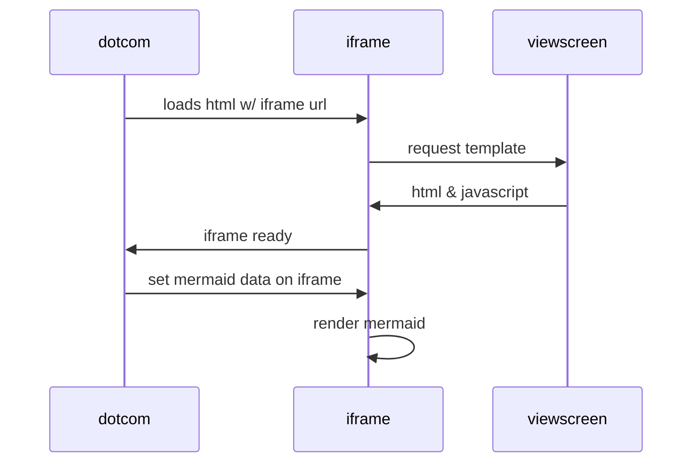

## Installation et premiers pas avec Qt 6.0

Cette série de tutoriels détaille l'installation de Qt 6.0, la configuration de Qt Creator, et comment créer votre première application.

- [Installation et premiers pas avec Qt 6.2](qt6/installation/README.md)

Le tutoriel pour Qt 5 n'est plus mis à jour : 

- [Installation et premiers pas avec Qt 5.14](qt5/index.md)

## Exercices et projets en C++

- [Exercices et projets en C++](exercices/README.md)

## Club de lecture

- [Club de lecture du discord NaN](club-lecture/)

- [Mes critiques de livres](critiques.md)

## Articles divers

- [Sélections de ressources pour le C++, Qt et le développement en général](articles/ressources.md)

## Mermaid dans GitHub markdown

https://github.blog/2022-02-14-include-diagrams-markdown-files-mermaid/

