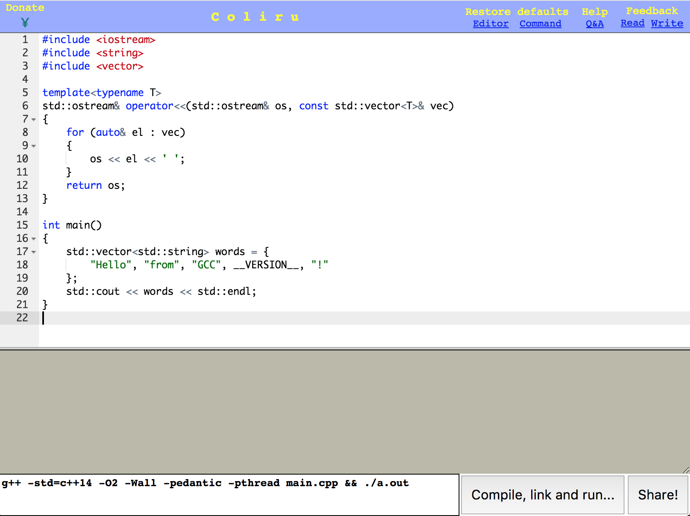
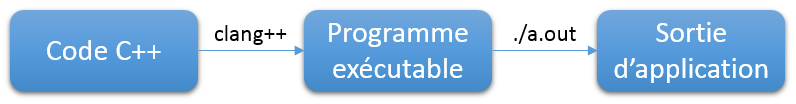

# Votre premier programme C++

> Mise a jour : 30 septembre 2017
>
> Retourner au sommaire : [Sommaire](../../index.md)
>
> Chapitre précédent
>
> Chapitre suivant

Dans ce chapitre, vous allez entrer enfin dans le vif du sujet et écrire vos premiers programmes en C++. Le 
but de ce chapitre et des suivants sera d'avoir un aperçu de la structure d'une programme C++ de base, du
processus de compilation, d'afficher des messages et de faire quelques calculs simples.

Créer une application en C++ n'est pas très compliqué. Commençons par voir un code C++ minimal, qui ne fait rien 
de particulier : l'application va démarrer puis se terminer. Même si de programme ne fait rien, il va nous permettre 
d'aborder quelques notions importantes.

## Tester l'environnement de compilation en ligne

Apprendre à utiliser les outils de développement est important, mais cela demande un peu de temps. Pour vous 
permettre de commencer tout de suite l'apprentissage des bases du langage C++, vous allez commencer par
utiliser des outils gratuits en ligne. L'utilisation des outils sera vu par la suite.

Le plus simple pour commencer est d'utiliser un editeur en ligne. Dans ce cours, vous allez voir celui de 
[Coliru.com](http://coliru.stacked-crooked.com). Si vous utiliser un autre editeur en ligne ou si vous utilisez
un editeur sur votre ordinateur, n'hésitez pas à demander sur les forums pour savoir comment les utiliser.

L'interface de Coliru est assez simple. Vous avez l'editeur en blanc au centre, dans lequel vous allez ecrire votre code
C++, et vous avez le bouton `Compile, link and run...` en bas a droite, pour lancer votre application. Les messages
de votre application seront affichés dans la console, qui correspond la partie grise au centre.



Lorsque vous ouvrez Coliru pour la premiere fois, l'éditeur contiendra un code d'exemple par defaut. Ce code est
trop complexe pour vous pour le moment. Vous pouvez l'effacer et le remplacer par le code suivant :

```cpp
int main() {
}
```

Ce code correspond au code minimal d'un programme C++. Vous pouvez le lancer en cliquant sur le bouton 
`Compile, link and run...`. Ne soyez pas surpris, comme le programme ne fait rien, ca se passe tres vite :
le bouton devient gris quelques instant puis redevient actif. Rien n'est affiché dans la console.

Si vous vous amusez à taper n'importe quoi dans le code (essayez !), vous verrez probablement un message
d'erreur s'afficher dans la console. Par exemple 

```cpp
int main() {
    hello, world!
}
```

affiche :

```
main.cpp: In function 'int main()':
main.cpp:2:5: error: 'hello' was not declared in this scope
     hello, world!
     ^~~~~
main.cpp:2:12: error: 'world' was not declared in this scope
     hello, world!
            ^~~~~
```

Il est important d'apprendre à lire les messages d'erreur, mais il n'est n'est pas necessaire de voir cela
dès ce premier chapitre. Pour le moment, vous n'avez besoin que de remarquer que le message contient le mot 
`error`, ce qui signifie qu'il y a une erreur de syntaxe dans le programme : vous n'avez pas écrit un code
C++ valide.

## Compiler un code C++

Fondamentalement, une application est une suite d'instructions données au processeur de votre ordinateur, qui lui indiquent 
les tâches qu'il doit accomplir. Ces instructions doivent être données sous une forme particulière, le plus souvent un 
fichier "binaire". Écrire directement un tel fichier est fastidieux, personne ne travaille comme ca depuis des dizaines d'années.

C'est pour cela que les programmes sont écrits dans des langages plus compréhensibles pour les humains, appelés _langages 
de programmation_. C++, Java, C#, PHP, Python, Javascript sont des exemples de langage de programmation.
Les programmes écrits dans un langage de programmation doivent être convertis dans un format compréhensible
par un ordinateur.

Aucun langage ne répond à tous les besoins, les développeurs connaissent généralement plusieurs langages, qu'ils 
utilisent en fonction des tâches qu'ils doivent réaliser. Nous vous conseillons d'apprendre un langage principal
et un à trois langages secondaires. Vouloir apprendre trop de langages peut nuire à votre apprentissage. Et évitez
d'étudier plusieurs langages en même temps, apprennez-les un par un.

Dans le cas du C++, cette étape est réalisée par un compilateur. Lorsque vous cliquez sur le bouton
`Compile, link and run...`, Coliru lance en fait la ligne de commande qui se trouve à gauche du bouton :

```
g++ -std=c++14 -O2 -Wall -pedantic -pthread main.cpp && ./a.out
```

Ces instructions sont en fait des commandes pour Linux. Le serveur utilisé par Coliru utilise Linux, mais les commandes 
sur Windows ou Mac OS X sont très proches. Si vous ne savez pas utiliser Linux en ligne de commande, ce n'est pas très 
grave pour le moment, mais il faudra apprendre cela par la suite.

Vous pourrez utiliser par la suite des outils qui se chargeront d'appeler ces instructions pour vous, de façon transparente.
Mais gardez quand même en mémoire que quel que soit l'outil que vous utiliserez, celui-ci ne fera rien d'autre que d'appeler 
ces instructions, comme vous pourriez le faire vous-même. Certains développeurs préfèrent compiler manuellement leurs 
programmes en utilisant directement des lignes de commande.

Le schéma suivant résume l'ensemble des étapes de compilation et d'exécution :



## La fonction main

Revenons maintenant sur le code C++ de notre programme. Ce code minimal définit une fonction appelée `main` (qui 
signifie "principal" en anglais), qui ne fait rien :

```cpp
int main() {
}
```

Une fonction est un ensemble d'instructions qui sont regroupées, et possède un nom. Cela permet d'organiser un 
programme en parties plus petites et donc plus simples à comprendre. De plus, si vous devez répéter plusieurs fois
la même suite d'instructions, vous pouvez l'écrire une seule fois dans une fonction, puis appelez cette fonction
plusieurs fois. Cela permet de gagner beaucoup de temps lors de l'écriture de vos programmes.

La fonction `main` est une fonction particulière, puisque cette fonction est appelée automatiquement lorsque
vous lancez l'application. C'est le "point d'entrée" du programme. Cette fonction doit également respecter
certaines contraintes :

- cette fonction est obligatoire ;
- cette fonction doit être unique ;
- vous ne pouvez pas appeler cette fonction ;
- la syntaxe est définie dans la norme C++.

La "norme C++" ou le "standard C++" est le document qui décrit l'intégralité du langage C++. C'est LA référence
du langage C++, la seule source valide dans l'absolue. Mais en pratique, la norme C++ n'est pas simple à lire,
les développeurs préfèrent utiliser d'autres sources. Dans ce cours, nous utiliserons le site
[cppreference](http://en.cppreference.com/) pour la documentation C++.


Pour terminer, la partie la plus importante : la suite d'instructions, dans un bloc de code définit par des accolades 
''{'' et ''}''. Chaque instruction se termine par un point-virgule. Dans le code d'exemple de ce chapitre, le bloc 
d'instructions est vide, il n'y a que les accolades, le programme ne fait rien (mais vous verrez dès le prochain chapitre 
les bases pour écrire des instructions).

<note>En fait, il existe plusieurs //signatures// pour la fonction ''main'' (i.e. plusieurs façons différentes d'écrire 
cette fonction). Cela permet en particulier au système d'envoyer des informations lors du lancement du programme, que 
vous pourrez utiliser dans votre code. Pour le moment, vous ne savez pas encore comment traiter ces informations, donc 
il n'est pas nécessaire de détailler ce point.</note>

## Mise en forme du code 

Vous avez maintenant les informations de base pour comprendre ce premier programme C++ (qui ne fait rien). Pour terminer 
ce chapitre, deux points importants, sur la présentation du code.

Dans un code C++, les espaces et les retours à la ligne ne sont pas pris en compte dans la compilation (sauf bien sûr si
vous accolez deux termes ensembles, si vous écrivez ''intmain'' sans espace, votre compilateur vous insultera copieusement). 
Vous pouvez donc ajouter des espaces et des retours à la ligne de façon à rendre votre code le plus lisible possible, sans 
que cela ne change votre programme.

<note>Un point important à ne pas oublier : un code sera plus souvent lu qu'il n'est écrit ou modifié. Il faut donc 
privilégier la qualité de lecture d'un code, plutôt que d'essayer de gagner du temps à l'écriture (même pour un simple 
code de test ou d'apprentissage). Présenter correctement un code permet de gagner du temps sur le long terme.</note>

Ainsi, le programme d'exemple peut s'écrire selon les façons suivantes :

```
int main(){}
```

```
int
main()
{
}
```

```
int     main     (     )     {     }
```

Il faut trouver un compromis entre la concision (écrire un code qui sera le plus compact possible) et avoir un code 
aéré. Il est habituel de définir des règles d'écriture du code, pour faciliter la lecture et permettre à plusieurs 
personnes de comprendre le code des autres développeurs. Il existe plusieurs conventions pour ces règles, à vous de 
choisir celles qui vous conviennent.

**Peu importe les règles de codage que vous choisissez, le plus important est surtout d'avoir des règles et de les respecter.**

En particulier, un point important est le respect de l'indentation. L'indentation correspond aux espaces placés en début 
d'une ligne. Le début des lignes doit être aligné selon son niveau hiérarchique. Si on écrit la hiérarchie suivante :

```
niveau 1
niveau 2
niveau 3
niveau 3
niveau 2
niveau 3
niveau 1
```

Il est assez difficile de visualiser facilement à quel niveau hiérarchique correspond chaque ligne. Si on utilise une
indentation pour distinguer chaque niveau, le code est beaucoup plus lisible :

```
niveau 1
    niveau 2
        niveau 3
        niveau 3
    niveau 2
        niveau 3
niveau 1
```

<note info>Vous trouverez des exemples de styles d'indentation du code dans 
[[http://fr.wikipedia.org/wiki/Style_d'indentation|la page de Wikipédia]] correspondante. Dans ce cours, j'utiliserais 
le style K&R, avec une indentation de quatre espaces.</note>

Il existe des outils permettant de mettre en forme le code et vérifier que la présentation du code respecte les règles 
que vous avez fixé. Ces outils seront présentés dans la suite de ce cours.

## Commentaires du code

Pour comprendre un code, les premières informations que le lecteur verra sont les noms que l'on donne. Appeler par 
exemple ses fonctions ''f1'', ''f2'' et ''f3'' n'aide pas du tout à comprendre à quoi servent ces fonctions. Par contre, 
appeler ces fonctions ''add'' (addition), ''save'' (enregistrer) ou ''reset'' (remettre à zéro) permet aux lecteurs d'avoir 
une idée de leur rôle.

**Il est important de prendre le temps de nommer correctement les choses, ce n'est pas une perte de temps.**

Cependant, il n'est pas toujours possible de trouver des noms significatifs (tout au moins, sans faire des noms de 100 
caractères). Dans ce cas, il est possible d'ajouter des commentaires dans le code, qui seront ignorés par le compilateur 
(et donc ne changeront par le comportement du programme généré) et seront destinés uniquement aux développeurs.

Il existe deux formes de commentaire. Les commentaires sur une ligne et les commentaires sur plusieurs lignes. Les 
commentaires peuvent être placés n'importe où dans votre code. Pour écrire un commentaire sur une ligne, vous devez 
utiliser deux barres obliques ''/​/'' suivies du commentaire. Pour un commentaire sur plusieurs lignes, il faut commencer 
le commentaire par une barre oblique puis un astérisque ''/*'' et terminer le commentaire par un astérisque puis une 
barre oblique ''*/''.

```cpp
// un commentaire sur une ligne

int main() { // un commentaire en fin d'une ligne
    /* un
    commentaire
    sur
    plusieurs
    lignes */
}
```

## Résumé du chapitre

- le compilateur prend du code C++ et le convertie en langage machine, pour etre comprehensible par un ordinateur.
- le compilateur vérifie votre code et vous indique les erreurs. C'est votre première et principale aide pour 
écrire du code C++ valide.
