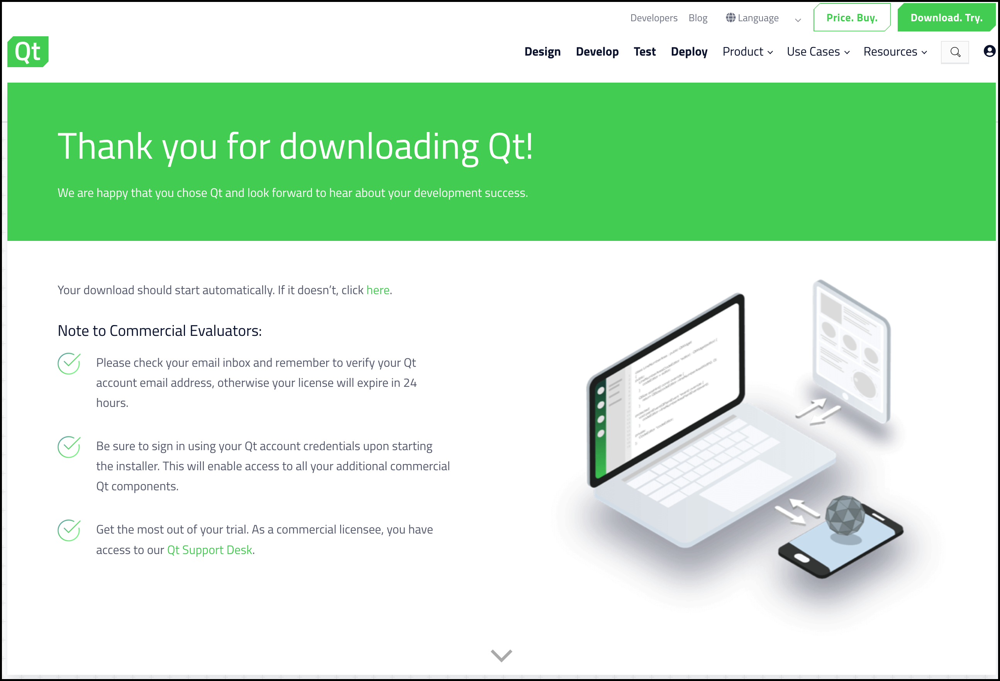
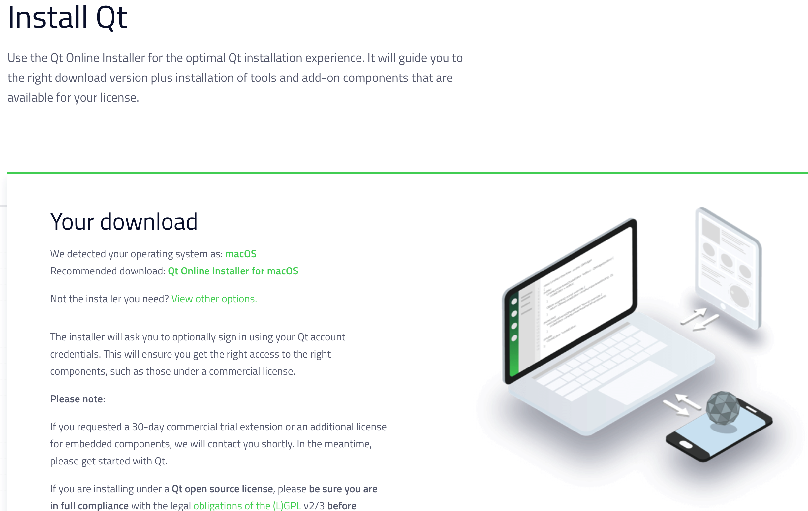
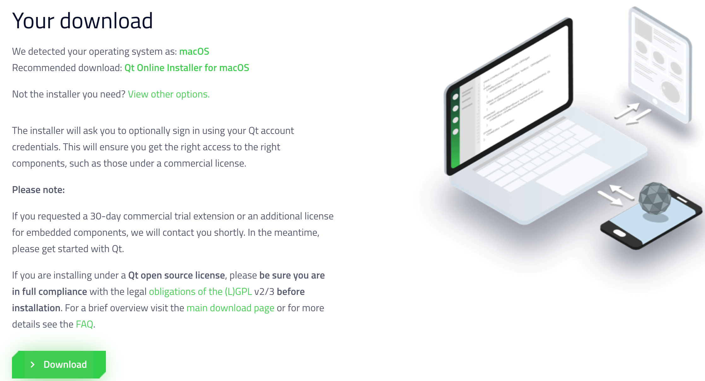
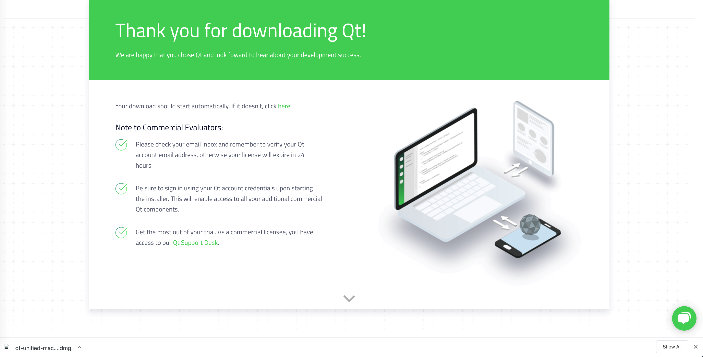

# Télécharger l'installateur de Qt

> [Revenir à la page "Installation et premiers pas avec Qt 6.2"](README.md)
> 
> Dernière mise à jour : 24 février 2022.

**Attention : évitez de télécharger des fichiers, en particulier des applications, sur des sites non-officiels, 
pour minimiser le risque d'installer des logiciels malveillants.**

## Le site officiel de Qt

### La page de téléchagement 

Vous pouvez retrouver facilement le site officiel en tapant `qt6 download` dans un moteur de recherche :


Dans cette capture d'écran, le premier lien https://www.qt.io/product/qt6 correspond à la page de présentation de Qt 6
et le second lien https://www.qt.io/download à la page de téléchargement de Qt 6.

Le site est conçu pour aider les utilisateurs à choisir la version correcte de Qt (en orientant pas mal vers la version 
commerciale...), ce qui le rend un peu complexe au premier abord.

Cliquez sur le bouton `Go open source` pour accéder à la page de téléchargement.


Dans ce tutoriel, nous allons installer la version
open-source de Qt (gratuite), donc nous n'allons pas détailler le site de Qt.

Pour ceux qui possèdent une licence commerciale de Qt : il est possible d'entrer votre numéro de licence, 
même si vous télécharger la version open-source. Et je trouve qu'il est plus facile de mettre à jour Qt si
vous installez la version open-source, donc je vous conseille de faire cela, même si vous avez une licence commerciale.



Descendez dans la page pour aller au bouton `Downloads for open sources users` et cliquez sur le bouton 
`Go open source`.


Vous arrivez alors sur la page de la version open source de Qt.


Descendez dans la page pour aller au bouton `Download the Qt Online Installer` et cliquez dessus.


La page suivante vous propose la version de l'installateur correspondant à votre système d'exploitation.
Par exemple, sur la capture d'écran précédente, vous pouvez lire les lignes suivantes :

```
We detected your operating system as: macOS
Recommended download: Qt Online Installer for macOS
```



Il existe d'autres options de téléchargement, mais la version proposée par défaut conviendra généralement.

Descendez sur la page pour aller sur le bouton `Download` et cliquez dessus pour lancer le téléchargement.



La page suivante indique que le téléchargement est lancé. Le nom de l'installateur dépend du système :

- pour Windows : `qt-unified-windows-x86-3.1.1-online.exe` ;
- pour Linux 32 bits : `qt-unified-linux-x86-3.1.1-online.run` ;
- pour Linux 64 bits : `qt-unified-linux-x64-3.1.1-online.run` ;
- pour Mac : `qt-unified-mac-x64-3.1.1-online.dmg`.

Le numéro de version correspond a l'installateur. Qt Creator (l'éditeur de code
de Qt) et Qt (le framework de developpement) ont des numéros de version differents, 
il ne faut pas les confondre.

Notez que le numéro de version de l'installateur pourra être différent lorsque vous téléchargerez
Qt.

L'installateur ne contient aucune version de Qt a proprement parlé. Lorsque vous le lancerez, il téléchargera les versions
de Qt que vous aurez sélectionné. Le téléchargement de l'installateur est donc rapide.



Une fois que le téléchargement est terminé (c'est rapide, le fichier ne fait que quelques Mo), vous pouvez 
lancer l'installateur.

### Autres liens utiles

Vous trouverez sur le [site officiel de Qt](http://www.qt.io/) d'autres liens interessants :

- la [documentation de Qt](http://doc.qt.io/), qui est accessible également dans Qt Creator en appuyant sur 
la touche `F1` ;
- le [blog officiel de Qt](http://blog.qt.io/dev/) et les [blogs partenaires de Qt](http://planet.qt.io/) ;
- le [wiki officiel de Qt](http://wiki.qt.io/Main), qui contient de nombreuses informations complementaires a la documentation ;
- le [forum officiel de Qt](https://forum.qt.io/), en anglais.

## Installateurs online et offline

Il existe deux versions de l'installateur : `online` et `offline`. Les deux versions installe l'outil
`Qt Maintenance Tool`, qui permet d'installer, desinstaller et mettre a jour Qt. La version `online` ne
contient que cet outil, et c'est celui-ci qui va installer Qt. La version `offline` contient tout
ce qui est necessaire pour installer une version complete de Qt, sans avoir besoin d'etre connecte
a internet _pendant l'installation_. Naturellement, l'installateur `offline` est plus volumineuse que 
l'installateur `online`.

Lors de l'installation de Qt, l'outil `Qt Maintenance Tool` est installe dans le repertoire d'installation de Qt. 
Par défaut, cet outil se trouve :

- pour Windows : dans `C:\Qt\maintenancetool.exe` ;
- pour Linux et Mac : dans `~/Qt/MaintenanceTool`.

## Autres téléchargements possibles

Si vous souhaitez voir les autres téléchargements possibles, vous pouvez cliquer sur le lien `View other options` 
ou sur `offline packages you can get them here`.

Le premier permet d'afficher les installateurs online pour tous les systèmes (linux 64b et 32b, Mac et Windows).

Le second permet d'afficher :

- Les installateurs offline pour la dernière version de Qt (actuellement la version 5.14) pour Linux, Mac et Windows ;
- Les installateurs offline pour les versions LTS (Long Term Support) de Qt (les versions 5.12 et 5.9) pour Linux, Mac et Windows ;
- L'éditeur Qt Creator seul ;
- les plugins pour Visual Studio ;
- l'outil JOM (outil de compilation similaire à nmake, dédié à Qt) ;
- le Qt Build Suite (QBS) (un outil de build, probable futur remplaçant de qmake) ;
- Qt Installer Framework (pour créer vos propres installateurs pour vos programmes) ;
- les dépôts Git de Qt ;
- les archives des anciennes versions de Qt (ce dernier lien permet en particulier de télécharger Qt 4 si nécessaire).
