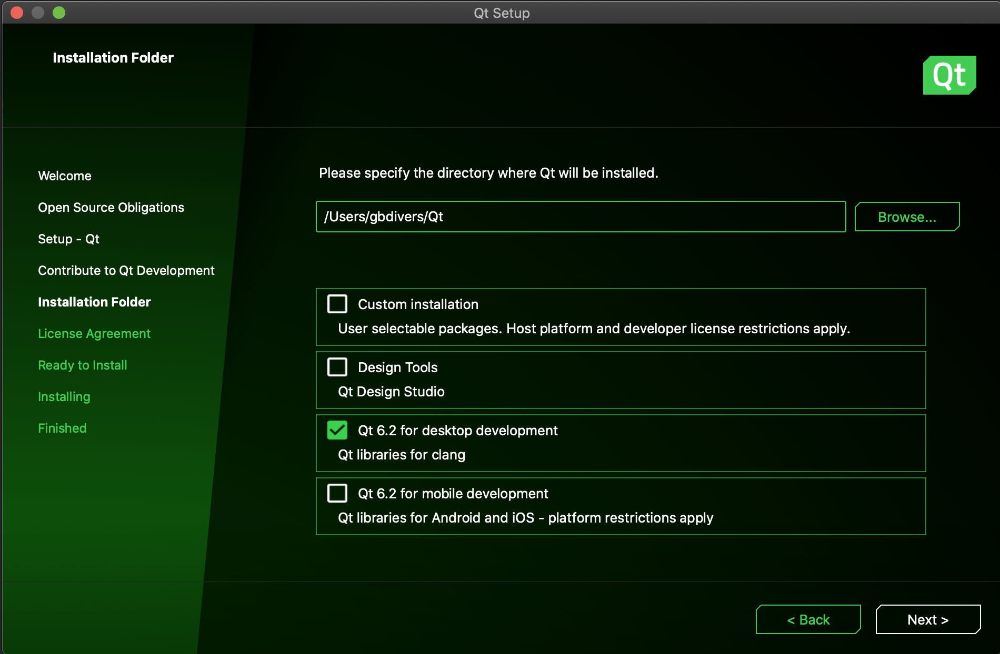
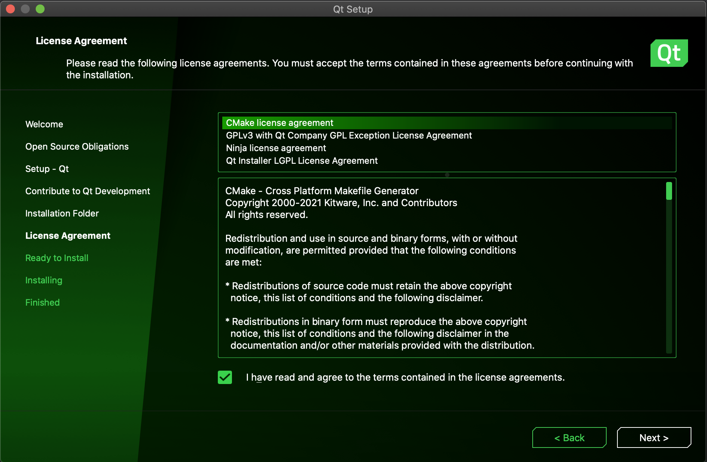
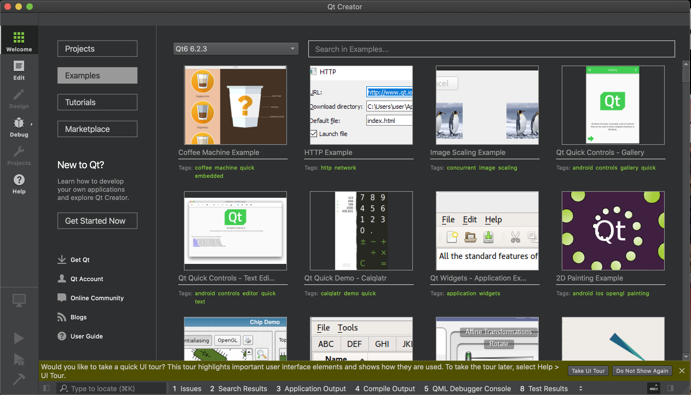

# Installer Qt

> [Revenir à la page "Installation et premiers pas avec Qt 6.2"](README.md)
> 
> Dernière mise à jour : 24 février 2022.

Lancez l'installateur que vous avez téléchargé à l'étape précédente.

La première page permet de se connecter à son compte Qt (le compte que vous utilisez sur `qt.io`). Si vous possédez
un compte avec une licence commerciale de Qt, cette licence sera automatiquement utilisée lors de l'installation.

Si vous n'avez pas encore créé un compte sur qt.io, vous pouvez le faire directement depuis l'installateur
en cliquant sur `Sign up`. La page suivante s'affichera :

Une fois que vous êtes connecté, une page informe des restrictions liées à l'utilisation de la licence open source
de Qt. Pour simplifier, tant que vous utilisez les options de compilation par défaut de Qt Creator, vous pouvez
utiliser la version open source, aussi bien pour faire des applications gratuites que commerciales.

Acceptez les conditions et cliquez sur `Next`.

La page suivante vous souhaite simplement la bienvenue.

La page suivante vous propose de contribuer à l'expérience utilisateur de Qt Creator en envoyant des
statistiques anonymisées de votre utilisation de Qt Creator. Vous pouvez acceptez si vous le souhaitez, mais
ce n'est pas obligatoire.

La page suivante permet de choisir le répertoire d'installation de Qt. Par défaut, ce repertoire
est `C:\Qt` sur Windows et `Users/your_name/Qt` sur MacOSX et Linux.

Vous pouvez changer le répertoire d'installation si vous le souhaitez. Dans la suite de ce tutoriel, nous 
allons utiliser le chemin par défaut. Si vous changez de répertoire, pensez à adapter les chemins donnés 
dans la suite de ce tutoriel.

La liste d'options en dessous du chemin d'installation permet de choisir entre différents types d'installation
par défaut. L'installation personnalisée est détaillée dans [Mettre à jour Qt](update.md). Dans ce tutoriel,
nous allons utiliser l'option `Qt 6.2 for desktop development`.

La page suivante permet de valider les licences correspondant aux outils que vous installez. Acceptez puis continuez.

Une fois que tout cela est fait, l'installation est prête à démarrer. La taille de l'installation sur le disque est
indiquée (cela dépend des options que vous avez choisi). Cliquez sur `Install`.

Le téléchargement puis l'installation se lancent. Selon votre connexion et le nombre de paquets que vous 
installez, cela peut prendre plusieurs minutes à plusieurs heures. Faites une pause, allez boire un café ou allez vous balader 
dehors, il fait beau (la pluie, c'est beau...).

Une fois l'installation terminée, l'installateur propose de lancer Qt Creator et d'ouvrir le fichier `README`.
Cliquez sur `Terminer`. 

Qt Creator s'ouvre et affiche la page d'accueil. Vous pouvez suivre le tutoriel d'introduction sur Qt Creator en
cliquant sur `Take UI tour`.

