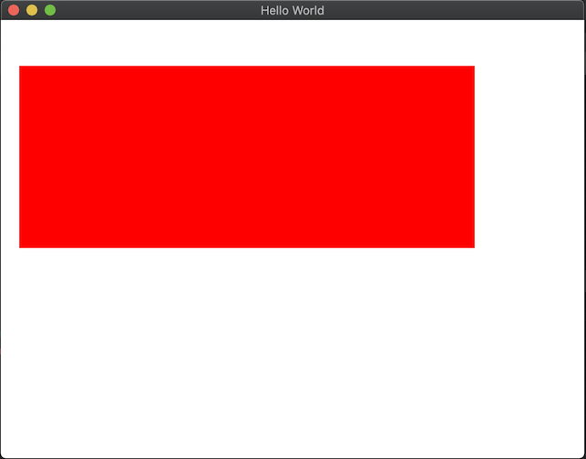

# Les bases du QML et Qt Quick

> [Revenir à la page précédente](README.md)

## Vue d'ensemble du QML et de QtQuick

Le QML et QtQuick sont indisociables, mais ce sont bien deux choses différentes. QtQuick est le module de
Qt qui fournit les fonctionnalités pour créer une interface graphique. Le QML est un langage basé sur le JavaScript et qui
permet d'utiliser QtQuick.

## Paradigme déclaratif

Le QML est un langage déclaratif. Vous connaissez déjà les paradigmes de programmation impératif, qui consiste à décrire la
liste des instructions à executer séquentiellement, et la programmation objet, qui consiste à encapsuler les instructions dans
des objets. La programmation déclaratif consiste à décrire les éléments qui constitue ce que vous souhaitez obtenir.

Pour illustrer, voici comment dessiner un rectangle avec ces trois paradigmes, en pseudo-code.

Avec le paradygme impératif, le code est une suite d'instructions qui sont exécutées une par une. Le résultat est atteint après que la
dernière ligne a été exécutée.

```
move_to(10, 10)
draw_to(10, 100)
draw_to(100, 100)
draw_to(100, 10)
draw_to(10, 10)
```

En programmation objet, vous créez des objets, modifiez leurs états internes (attibuts ou variables membres) et leur demandez de rendre des 
services (fonctions membres). Comme pour le paradigme impératif, le code est exécuté séquentiellement, ligne par ligne. La différence est
que ce ne sont plus des instructions, mais des manipulations d'objets.

```
Rectangle r;
r.setPosition(10, 10)
r.setSize(90, 90)
r.draw()
```

En programmation déclaratif, il n'y a plus d'exécution séquentielle d'instructions. Le code décrit des composants qui ont un type et des propriétés.
L'ordre dans lequel vous écrivez les propriétés n'a pas d'importance. C'est comme si les lignes étaient exécutées toutes en même temps et le 
résultat est obtenu en une seule fois, après que le composant est créé et paramétré.

```js
Rectangle {
    x: 10
    y: 10
    width: 90
    height: 90
};
```

Aucun paradigme n'est meilleur que les autres, mais certains sont plus adaptés à certains domaines ou problèmes spécifique.
Le déclaratif se prête bien à la description d'interface graphique, par exemple le QML et le HTML.

## Un premier exemple de code QML

Pour commencer, voyons un code de base en QML. Copiez-collez le code suivant dans un projet "Qt Quick Application".

```js
import QtQuick

Window {
    width: 640
    height: 480
    visible: true
    title: qsTr("Hello World")

    Rectangle {
        x: 20; y: 50
        width: 500; height: 200
        color: "red"
    }
}
```

Lorsque vous lancez l'application, vous obtenez le résultat suivant :



Sans surprise (si vous comprenez l'anglais), le résultat obtenu est une fenêtre (`Window`) qui contient un rectangle (`Rectangle`)
rouge (`red`), de 500 pixels de large (`width`) pour 200 pixels de haut (`height`). Vous voyez immédiatement la simplicité du langage 
QML, ce code peut être compris assez facilement.

Faites des testes en changeant les dimensions, la couleur, et d'autres propriétés, et voyez ce que vous obtenez.

## Importation des modules QtQuick

Un code QML commence généralement par la liste des modules importés. Pour organiser les fonctionnalités de QtQuick, les composants
sont regroupés par module logique. Par exemple, il existe un module QtQuick.Particles pour les effets de particules, QtQuick.Layout
pour les outils de positionnement des éléments et ainsi de suite.

La documentation de chaque composant indique quel module vous devez importer. Par exemple, si vous consulter la documentation de
[Button](https://doc.qt.io/qt-6/qml-qtquick-controls2-button.html), il est indiqué qu'il faut ajouter `import QtQuick.Controls` pour
importer le module `QtQuick.Controls` dans votre code QML et pouvoir utiliser ce composant.


Dans le code précédant, la ligne `import QtQuick` permet donc d'importer le module de base de QtQuick et d'utiliser les composants
que vous allez voir dans la suite de ce chapitre : `Window` et `Rectangle`.

## Créer un élément en QML

Après la liste des importations, vous trouverez généralement l'élément qui se trouve a la racine.

La syntaxe générale pour créer un élément est la suivante : le type d'élément (le composant) suivi de la déclaration des propriétés
de cet élément dans un bloc de code défini par des accolades.

```js
COMPOSANT {
    // liste des propriétés
}
```

Par exemple, pour créer un rectangle, le code sera :

```js
Rectangle {
}
```

Il n'est pas possible d'avoir plusieurs éléments à la racine d'un code QML. Par exemple, le code suivant n'est pas valide :

```js
Rectangle {
}

Rectangle {
}
```

Par contre, il est possible d'imbriquer des éléments et d'avoir un élément qui contient un ou plusieurs éléments. Par exemple, le code
suivant contient un autre rectangle.

```js
Rectangle {
    Rectangle {
    }
}
```

Comme en C++, il est classique d'indenter le code, en ajoutant des espaces de façon à montrer visuellement la hiérarchie des éléments.
Qt Creator propose automatiquement l'indentation en fonction de la hiérarchie et il est possible de reformater un code QML complet en
tapant `Ctrl+A` puis `Ctrl+I`.

Un autre exemple d'éléments imbriqués est donné dans le premier code d'exemple, avec l'élément rectangle qui imbriqué dans l'élément 
fenêtre.

Cette hiérarchie des éléments a un impact sur leur positionnement et les liens entre eux. Cela sera détaillé par la suite.

## Modifier les propriétés d'un élément

Chaque élément possède des propriétés, que vous pouvez modifier pour personnaliser cet élément. Si vous ne modifier pas une
propriété, elle aura généralement une valeur par défaut (par exemple 0 pour la position et les dimensions d'un rectangle).

La syntaxe générale pour modifier une propriétéest la suivante : le nom de la propriéte puis sa valeur, séparé par deux points.

```js
PROPRIÉTÉ: VALEUR
```

Par exemple, pour modifier la couleur d'un rectangle, vous pouvez écrire :

```js
Rectangle {
    color: "blue"
}
```

Pour modifier plusieurs propriétés, vous pouvez les écrire sur des lignes différentes ou les séparer par un point-virgule.

```js
Rectangle {
    x: 10; y: 20
    color: "green"
}
```

La liste des propriétés que vous pouvez utiliser dépend du type de composant. Vous devez consulter la documentation pour avoir
cette liste. Par exemple, la documentation du compostant 
[Rectangle](https://doc.qt.io/qt-6/qml-qtquick-rectangle.html) indique que celui-ci contient les propriétés `border.width`, `border.color`, 
`color` ou encore `radius`.


Essayez de modifier ces propriétés dans le premier code d'exemple, pour voir leur effet.

Lorsqu'une propriété contient plusieurs autres propriétés, par exemple `border` qui contient les propriétés `width` et `color`, il est possible
de regrouper ces propriétés dans un bloc.

```js
border.width: 1
border.color: "red"

// ou

border {
    width: 1
    color: "red"
}
```

Dans la documentation, vous pouvez voir aussi que chaque propriété possède une type. Par exemple, la propriété `antialiasing` est 
de type `bool` (booléen). Si vous ne respectez par le type, vous obtiendrez un message d'erreur et votre interface graphique ne
s'affichera pas.

Par exemple, si vous écrivez :

```js
antialiasing: "hello world"
```

Vous obtiendrez le message d'erreur suivant :

```
QQmlApplicationEngine failed to load component
qrc:/untitled/main.qml:13:23: Invalid property assignment: boolean expected
```

("échec du chargement du composant" puis "Affectation de propriété non valide : valeur booléenne attendue")

Les types des propriétés sont assez proche de ceux que vous connaissez deja en C++ :

- `bool` pour les booléens ;
- `int` pour les nombres entiers ;
- `real` pour les nombres à virgules ;
- `color` est similaire à la classe `QColor` dans Qt et peut accepter plusieurs syntaxes ;
- `any` correspond à `std::any` en C++ et permet aussi d'accepter plusieurs syntaxes pour cette propriété.

Les types de propriétés seront plus en détail dans le chapitre suivant.

## Les composants Rectangle et Item

Dans la documentation de [Rectangle](https://doc.qt.io/qt-6/qml-qtquick-rectangle.html), vous avez peut-être remarqué que certaines
propriétés présentées dans les codes d'exemple sont absentes, par exemple `x`, `y`, `width` et `height`. Cependant, si vous cliquez
sur le lien vers [Item](https://doc.qt.io/qt-6/qml-qtquick-item.html), vous trouverez ces propriétés.

Vous retrouvez ici un concept que vous connaissez bien en C++ (et plus généralement en programation objet) : l'héritage. Comme indiqué à la ligne
`Inherits: Item`, cela signifie que le composant `Rectangle` dérive du composant `Item` et donc il hérite de toutes les propriétés de `Item`.

Quand vous utiliserez un composant, il faudra bien regarder l'ensemble de ses proprietes dont il hérite.

`Item` est le composant de base de tous les autres éléments graphiques, ce qui implique que ses propriétés sont utilisables pour
tous les autres éléments graphiques. Toutes les propriétés se sont pas détaillées ici, vous verrez d'autres propriétés dans les chapitres
suivants.

Quelques propriétés intéressantes à connaître :

- `x`, `y`, `width` et `height` : la position et la taille de l'élément graphique.
- `z` : la profondeur. Quand plusieurs éléments se superposent, ils sont affichés par ordre croisant.
- `enable` et `visible` : un élément peut etre activé ou non, et visible ou non.
- `opacity` : pour modifier la transparence d'un élément.
- `clip` : quand un élément contient un élément enfant qui déborde, l'affichage peut être limité (clipé) ou non.
- `rotation` et `scale` : pour modifier la rotation et la taille d'un élément.

## La propriété id et le binding

Reprenons le premier code d'exemple et modifions le code pour les propriétés `width` et `height` de la façon suivante, puis copiez-collez
le code dans un projet dans QtCreator :

```js
import QtQuick

Window {
    id: root
    width: 640
    height: 480
    visible: true
    title: qsTr("Hello World")

    Rectangle {
        x: 20; y: 50
        width: parent.width / 2
        height: root.height / 2
        color: "red"
    }
}
```

Lorsque vous modifier la taille de la fenêtre, vous pouvez constater que la taille du rectangle rouge est modifiée en même temps.

Cette fonctionnalité du QML s'appelle le "binding" ("lien"). Cela consiste à lier la valeur d'une propriété à un ou plusieurs autres propriétés.
Lorsque ces propriétés liées sont modifiées, alors la propriété est mise à jour aussi. Dans l'exemple précédent, la hauteur et la largeur
du rectangle rouge est calculée automatiquement à partir de la hauteur et la largeur de la fenêtre.

Dans une expression, il est parfois nécessaire de spécifier à quel élément correspond une propriété. La syntaxe pour faire cela est
d'utiliser l'identifiant de l'objet suivi de la propriété, séparé par un point. L'identifiant d'un objet est determiné par la propriété
`id`. Il est classique d'appeler l'éléement à la racine du fichier QML par "root". Il est également possible d'utiliser `parent` pour 
indiquer l'élément parent.

```js
// définir un identifiant
id: mon_element

// syntaxe pour lier une propriété
mon_element.la_propriété
```

**Note :** les expressions utilisées dans un binding sont écrites en JavaScript. C'est une des manières d'intégrer du code non déclaratif
dans un code QML. Vous verrez dans le chapitre "JavaScript en detail".

## Le composant Text

Servira a écrire du texte dans l'UI et donc identifier chaque composant en cours de développement.

Dérive de `Item`, donc possède les propriétés de positionnement (`x`, `y`, `width` et `height`) et une propriété `text`. 
D'autres propriétés pour la mise en forme : [documentation de Text](https://doc.qt.io/qt-5/qml-qtquick-text.html).

## Exercices

Pour bien assimiler les explications données dans ce chapitre, il est nécessaire de mettre en pratique. Voici quelques exercices à réaliser.

- dessiner un rectangle de 100 sur 100, qui tourne lorsque la fenêtre est redimenssionnée.
- idem pour la transparence.
