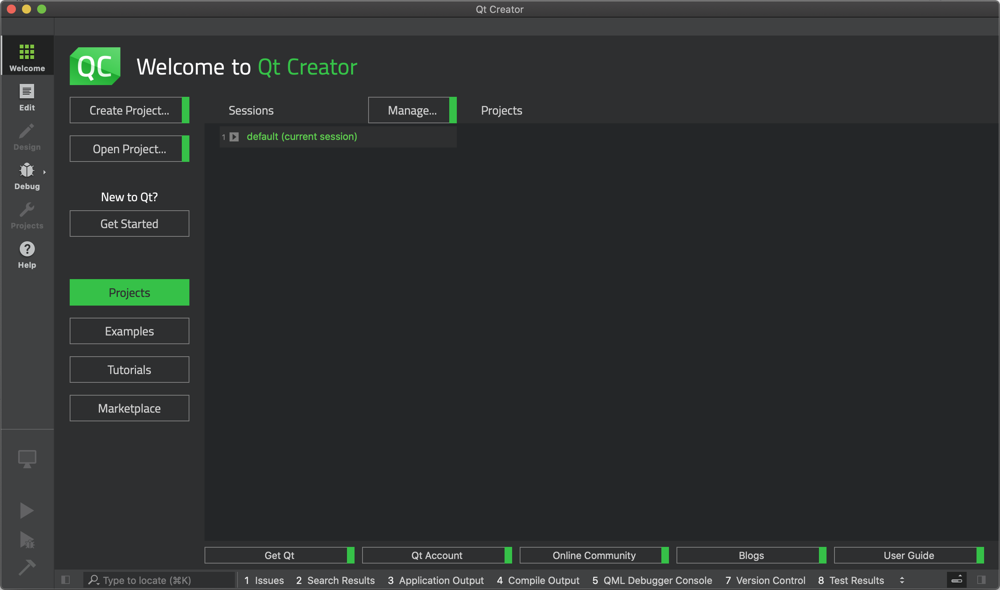

# Premiers pas avec Qt Creator (en cours de rédaction)

> [Revenir à la page principale du tutoriel](../README.md)

Qt Creator est l'éditeur fournit dans Qt pour écrire du code, compiler et executé vos applications Qt. Cet outil est automatiquement
configuré lors de l'installation de Qt et peut donc être utilisé directement quand vous avez fini l'installation. C'est pour des 
raisons de simplicité que Qt Creator est utilisé dans ce tutoriel.

Cependant, cela ne veut pas dire que Qt Creator est l'outil qui vous conviendra le mieux. Vous pourrez être intéressé par d'autres
outils et vous êtes tout à fait libre de les utiliser. Mais pour suivre ce tutoriel et vos premiers pas avec Qt 6, je vous conseille
quand même de tester Qt Creator dans un premier temps. Quand vous connaîtrez mieux Qt, vous pourrez explorer d'autres outils par
vous même.

Dans cette premirère partie du tutoriel sur Qt Creator, nous allons voir :

- L'interface générale de Qt Creator.
- Comment créer, compiler et exécuter un projet par défaut.
- Explorer les projets d'exemple.

## L'interface de Qt Creator

## Créer un projet avec Qt Creator

Creer un projet dans github. Utiliser git dans QtCreator.

## Créer un projet sur GitHub

## Projets d'exemple

explorer les projets et les lancer. Etudier le code.

## Tests, debug, deployement, cross plateformes
