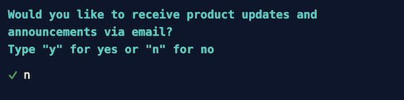
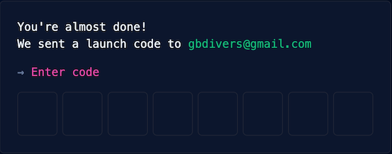
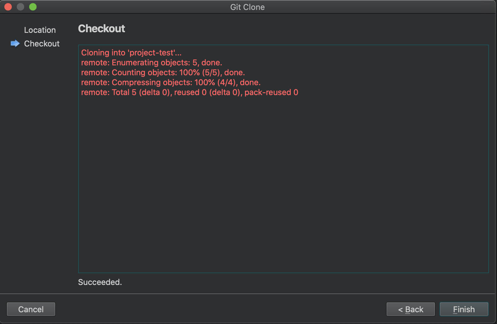

# Créer un dépôt sur GitHub

> [Revenir à la page précédente](README.md)

## Pourquoi utiliser Git et GitHub

Il existe deux contraintes importantes lorsque les projets deviennent de plus en plus conséquents : conserver l'historique 
des modifications (versionnage) en cas de problème et pouvoir partager les codes sources entre les développeurs. Git est un
outil qui permet de conserver et partager les différentes versions d'un projet. GitHub est un site qui permet de partager des
projets et facilite le travail collaboratif entre plusieurs développeurs.

Ces outils ne sont pas indispensable, en particulier si vous debutez. Mais je vous conseille quand même de les utiliser le plus
tôt possible, pour les apprendre.

Le principe générale d'un projet versionné, c'est que tout ce qui se passe dans un dossier de votre ordinateur est enregistré et
chaque développeur possède une copie de ce dossier. Le dépôt sur GitHub conserve aussi une copie de votre dossier. A chaque fois
qu'une des copies du dossier est modifiée, les modifications doivent être envoyé (`push`) aux autres développeurs et ceux-ci
doivent récupérer (`pull`) les modifications.

Qt Creator fournit des outils en interne pour manipuler des projets versionnés avec Git.

Note : Git et GitHub sont deux outils parmis d'autres. Peut être que d'autres outils similaires vous conviendront mieux dans
l'avenir. Pour faciliter la lecture de ce tutoriel sur Qt, je vous conseille quand même de les utiliser dans un premier temps.

Pour en savoir plus sur Git, vous pouvez lire le livre gratuit et en français [Git Book](https://git-scm.com/book/fr/v2). Et
pour la documentation de GitHub en anglais [GitHub Docs](https://docs.github.com/en).

## Créer un compte sur GitHub

Pour pouvoir créer des dépôts (projet versionné) sur GitHub, vous devez avoir un compte sur https://github.com. Lorsque vous allez 
pour la première fois sur GitHub, vous devriez voir la page suivante :

Si vous avez déjà un compte sur GitHub, vous pouvez vous connecter en cliquant sur `Sign in` en haut à droite. Sinon, vous pouvez
cliquez sur `Sign up` en haut à droite pour créer un compte. Cela affiche un dialogue, qui vous demande votre addresse email. Cet
email doit être valide.

L'étape suivante est de créer un mot de passe, en respectant les contraintes indiquées.

Entrez ensuite un nom d'utilisateur. Ce nom sera utilisé dans l'URL de GitHub pour accéder à votre compte et vos dépôts. Par exemple,
si vous choisissez "coucou" comme pseudo, votre URL pour GitHub sera https://github.com/coucou.

Tapez ensuite `n` pour refuser de recevoir des annonces de GitHub par email ou `y` si vous acceptez d'en recevoir.

Une fois toutes les informations entrées, cliquez sur `Create account` pour valider la création de votre compte GitHub.

Pour valider votre addresse email, GitHub vous envoie un email contenant un code d'authentification.

Entrez ce code sur GitHub.

Votre compte GitHub est alors créé. Le site vous demande alors quelques informations supplémentaires, mais vous pouvez passer
en cliquant sur `Skip personalization`.

## Créer un dépôt ("repository") sur GitHub

L'étape suivante est de créer un dépôt (un projet versionné) sur GitHub, puis de le copier (le cloner) sur votre ordinateur.

Lorsque vous arrivez sur votre page GitHub pour la première fois, celle-ci ne contient encore aucun dépôt. Différentes pages
d'aide sur GitHub sont proposées, n'hésitez pas à les consulter.

Vous pouvez créer votre premier dépôts en cliquant sur le bouton `Create repository` en haut à gauche.

La page suivante permet de configurer votre nouveau dépôt. La première chose à faire est de choisir un propriétaire ("owner", ce
qui est utile uniquement si vous avez plusieurs comptes GitHub) et un nom de dépôt unique (faites simple). En dessous, vous
pouvez ajouter une courte description de votre dépôt, pour ceux qui visiterait votre page GitHub.

L'option suivante permet de choisir entre créer un dépôt publique ou privé. Un dépôt publique peut être vu par n'importe quel
visiteur sur votre page GitHub, un dépôt privé ne sera visible que par ceux que vous autorisez. Le nombre de dépôts privés est
limité si vous avec un compte gratuit sur GitHub, je vous conseille de laisser le dépôt en public. Cela vous permettra de partager
votre codet et demander des conseils sur les forums ou discord.

Ce qui suit est optionnel, mais je vous conseille de faire ces étapes aussi. 

Un dépôt minimal peut ne rien contenir, mais il existe plusieurs fichiers qu'il est d'usage de retrouver systématiquement sur
tous les dépôts GitHub. Pour vous évitez de perdre du temps à créer ces fichiers, GitHub peut les générer automatiquement, en
suivant des modèles pré-existants.

Le fichier `README.md` est la description de ce que contient votre dépôt. C'est le premier fichier que les développeurs vont lire
pour découvrir votre projet et c'est ce fichier que GitHub affiche par défaut. Ce fichier contient généralement des explications
sur comment utiliser votre projet, comment le compiler, où trouver la documentation, etc. L'extention `.md` indique que ce fichier
est écrit avec markdown, un langage de rédaction très simple à utiliser. Pour en savoir plus sur le markdown sur GitHub :
[Basic writing and formatting syntax](https://docs.github.com/en/get-started/writing-on-github/getting-started-with-writing-and-formatting-on-github/basic-writing-and-formatting-syntax)

Le fichier `.gitignore` permet d'indiquer à Git quels fichiers il doit ignorer. Lorsque vous travaillez sur un projet, de nombreux
fichiers temporaires ou cachés sont créé par Qt Creator. Ces fichiers ne doivent pas être partagé et `.gitignore` permet d'éviter cela.
La liste des fichiers à ignorer dépend du type de projet. Heureusement, GitHub propose un modèle de `.gitignore` adapté pour Qt. Il
vous suffit de le sélectionner dans la liste.

Pour terminer, il est d'usage de mettre un fichier indiquant la licence d'utilisation du projet, même si vous ne voulez pas protéger
votre projet. La raison est que ceux qui seront intéressé par votre projet voudront connaître la licence et s'il ne trouve rien,
ils ne sauront pas quoi faire. Au pire, choisissez `unlicense` (sans licence), mais par exemple `mit` est très bien et classique.

Cliquez sur `Create repository` pour créer le dépôt.

Le nouveau dépôt est créé et les fichiers générés. L'interface de GitHub ne va pas être détaillée, mais n'hésitez pas à consulter la
documentation de GitHub pour en apprendre un peu plus sur l'interface et les outils proposés. Pour le moment, la seule fonctionnalité
que vous allez utiliser est le bouton vert `Code` en haut à droite.

Pour cloner votre dépôt sur votre ordinateur, c'est-à-dire pour créer une copie versionnée de votre projet, vous avez besoin de l'URL
du projet. Le mieux est d'utiliser le protocole SSH, mais cela nécessite de configure SSH sur votre ordinateur et d'enregistrer la
clé publique dans la configuration du projet sur GitHub. Je vous conseille de lire la documentation de GitHub et de configurer SSH.

Pour simplifier, dans ce tutoriel, nous allons utiliser le protocole HTTPS. L'URL est de la forme : https://github.com/pseudo/nomprojet.
Cliquez sur le bouton à droite de l'URL pour la copier.

Les étapes suivantes se passent dans Qt Creator, sur votre ordinateur. La finalité sera d'avoir un dépôt local sur votre ordinateur,
puis de créer un projet Qt dans ce dépôt. Ensuite, vous pourrez modifier votre projet Qt et envoyer vos modifications (`push`) sur
votre dépôt en ligne dans GitHub.

La création du dépôt local est expliqué ci-dessous, la création du projet Qt est expliquée dans le chapitre suivant.

Dans Qt Creator, créez un nouveau projet dans le menu `File` puis `New file or Project...`. Le dialogue qui s'ouvre contient deux listes
de choix. À gauche, dans les catégories de projets et de fichiers, sélectionnez `Import project`. À droite, dans la liste des types de
projets, sélectionnez `Git clone`. Cliquez ensuite sur `Choose...`.

Dans le champ `Repository:`, entrez l'URL du dépôt que vous avez créé dans GitHub. Dans le champ `Path:`, sélectionnez le dossier dans
lequel vous souhaitez créé votre dépôt. Par défaut, le champ `Directory:` correspond au nom du dépôt Git, mais vous pouvez changer si
vous le souhaitez.

Cliquez sur `Next`.

La copie du dépôt se lance et les différentes étapes sont affichées dans la zone de texte. À la fin, vous devriez avoir `Succeeded` en
bas de la zone de texte si tout c'est bien passé.

Cliquez sur `Finish`.

Après que le dépôt est copié sur votre ordinateur, Qt Creator essaie d'ouvrir un projet Qt dans ce dépôt. Cependant, pour le moment,
c'est juste un dépôt vide, qui ne contient aucun projet Qt. Qt Creator affiche alors une fenêtre pour indiquer que l'ouverture à
échouée.

Mais pas d'inquiétude, si vous avez bien eu le message `Succeeded` à l'étape précédante, le dépôt a bien été cloné. Vous pouvez le vérifier
en ouvrant le dossier du dépôt, celui-ci devrait contenir les trois fichiers créés par défaut (`.gitignore`, `LICENSE` et `README.md`).

Nous allons voir dans le chapitre suivant comment créer un projet Qt. Vous pouvez cliquer sur `Ok` pour fermer ce dialogue.

## Versionner le projet avec Git

Dans le chapitre précédent, vous avez créer un dépôt Git local pour versionner votre projet et 

Mettre le projet Qt dans le dépôt Git et envoyer les modifications sur GitHub

copier les fichier `untilted1.pro`, `main.cpp` et `main.qml` dans le depot.

Dans Qt Creator, faites `Ouvrir un projet` et selectionner le fichier `untilted1.pro`.

Dans le menu Tools > Git > Local Repository > Commit...

- information : nom et email
- description 
- fichiers : untracked = pas dans le versionning, cliquez sur `ajoutez tout`

Cliquez sur `Commit (3/3)` pour créer localement un commit = un ensemble de modifications

Envoyer le commit sur GitHub avec la commande Push, dans le menu Tools > Git > Remote Repository > Push

Sur GitHub, les fichiers sont visibles.

Cliquez sur `Commit` pour avoir la liste des commits.

Cliquez sur le dernier commit, pour voir les modifs contenues dans ce commit : 3 ajouts de fichiers.

