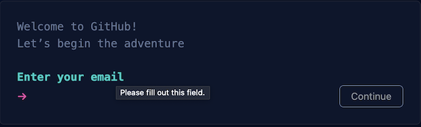
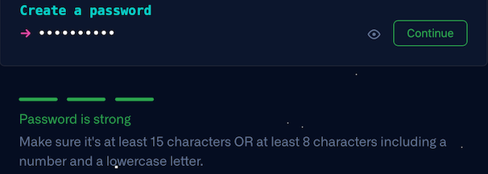

# Créer un dépôt sur GitHub

> [Revenir à la page précédante](README.md)

## Pourquoi utiliser Git et GitHub

Il existe deux contraintes importantes lorsque les projets deviennent de plus en plus conséquents : conserver l'historique 
des modifications (versionnage) en cas de problème et pouvoir partager les codes sources entre les développeurs. Git est un
outil qui permet de conserver et partager les différentes versions d'un projet. GitHub est un site qui permet de partager des
projets et facilite le travail collaboratif entre plusieurs développeurs.

Ces outils ne sont pas indispensable, en particulier si vous debutez. Mais je vous conseille quand même de les utiliser le plus
tôt possible, pour les apprendre.

Le principe générale d'un projet versionné, c'est que tout ce qui se passe dans un dossier de votre ordinateur est enregistré et
chaque développeur possède une copie de ce dossier. Le dépôt sur GitHub conserve aussi une copie de votre dossier. A chaque fois
qu'une des copies du dossier est modifiée, les modifications doivent être envoyé (`push`) aux autres développeurs et ceux-ci
doivent récupérer (`pull`) les modifications.

Qt Creator fournit des outils en interne pour manipuler des projets versionnés avec Git.

Note : Git et GitHub sont deux outils parmis d'autres. Peut être que d'autres outils similaires vous conviendront mieux dans
l'avenir. Pour faciliter la lecture de ce tutoriel sur Qt, je vous conseille quand même de les utiliser dans un premier temps.

## Créer un compte sur GitHub

Pour pouvoir créer des dépôts (projet versionné) sur GitHub, vous devez avoir un compte sur https://github.com. Lorsque vous allez 
pour la première fois sur GitHub, vous devriez voir la page suivante :

Si vous avez déjà un compte sur GitHub, vous pouvez vous connecter en cliquant sur `Sign in` en haut à droite. Sinon, vous pouvez
cliquez sur `Sign up` en haut à droite pour créer un compte. Cela affiche un dialogue, qui vous demande votre addresse email. Cet
email doit être valide.

L'étape suivante est de créer un mot de passe, en respectant les contraintes indiquées.

Entrez ensuite un nom d'utilisateur. Ce nom sera utilisé dans l'URL de GitHub pour accéder à votre compte et vos dépôts. Par exemple,
si vous choisissez "coucou" comme pseudo, votre URL pour GitHub sera https://github.com/coucou.

Tapez ensuite `n` pour refuser de recevoir des annonces de GitHub par email ou `y` si vous acceptez d'en recevoir.

Une fois toutes les informations entrées, cliquez sur `Create account` pour valider la création de votre compte GitHub.

Pour valider votre addresse email, GitHub vous envoie un email contenant un code d'authentification.

Entrez ce code sur GitHub.

Votre compte GitHub est alors créé. Le site vous demande alors quelques informations supplémentaires, mais vous pouvez passer
en cliquant sur `Skip personalization`.

## Créer un dépôt sur GitHub

