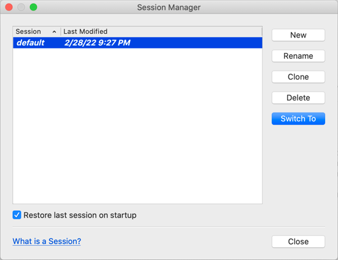

# L'interface de Qt Creator

> [Revenir à la page principale du tutoriel](README.md)

Lors du premier lancement de Qt Creator, vous arrivez sur la page d'accueil suivante. Cette fenêtre contient une zone de travail
centrale (qui présente les projets d'exemple, dans la capture d'écran suivante) entouré de plusieurs barres (une barre de menus au dessus,
une barre d'outils à gauche et une autre en bas).

Je suppose qu'il n'est pas nécessaire d'expliquer ce qu'est une barre de menus.

## La selection des modes

La barre d'outils à gauche contient deux groupes d'outils : les modes en haut et les boutons de compilation et d'exécution en bas.

Les modes sont une mode de travail de Qt Creator. Dans la capture d'écran, le mode actif est `Welcome`, qui permet de créer ou d'ouvrir
des projets, d'afficher les projets d'exemple, d'accéder à des tutoriels, etc. Le mode `Edit` est le mode que vous utiliserez le plus
souvent. C'est le mode utilisé lors que vous écrivez du code. Le mode `Design` permet de créer vos interface graphique à l'aide d'un
éditeur visuel. Le mode `Debug` permet d'utiliser différents outils qui vous aideront à corriger vos programmes. Le mode `Project` permet
de configurer vos projets. Le mode `Help` permet d'afficher les pages d'aide de Qt.

## Les boutons de compilation et d'exécution

Le groupe de boutons en bas permettent de compiler et d'exécuter vos projets.

Le premier bouton en haut (l'écran d'ordinateur) permet de sélectionner la configuration à utiliser pour compiler et exécuter vos projets. 
Chaque projet peut être compilé en utilisant plusieurs configurations. Par exemple pour exécuter sur l'ordinateur, sur un appareil iOS ou 
Android, etc. Ce bouton permet de changer rapidement entre les différentes configurations que vous avez créées.

Le bouton suivant (le triangle vert) permet de compiler et exécuter votre projet, en utilisant la configuration sélectionnée. C'est le bouton
que vous utiliserez le plus souvent. Vous pouvez également utiliser le raccourci clavier `Ctrl+R` sur Windows et Linux ou `Cmd+R` sur MacOS.

En dessous, le bouton (le triangle vert avec un insecte) permet de comppiler et exécuter votre projet en mode debug. Le mode debug permet
de compiler votre projet en activant des options qui facilitent la recherche d'erreurs dans vos programmes. Dans ce mode, la compilation et
l'exécution de votre programme est généralement plus lente, ce qui explique pourquoi ce type de compilation est utilisé que pour trouver les
erreurs.

Le dernier bouton (le marteau) permet de compiler uniquement votre application. On utilise cela en général juste pour que le compilateur
vérifie que le code est correct, sans lancer l'exécution de l'application. Vous pouvez également utiliser le raccourci clavier `Ctrl+B` 
sur Windows et Linux ou `Cmd+B` sur MacOS.

## L'outil de recherche et les fenêtres de sortie

## Le contenu central

## Gérer les sessions

Sans entrer en détail dans la configuration de Qt Creator, il y a une fonctionnalité très utile que je vous conseille d'activer.
Allez dans le menu `File` puis `Sesssion` puis `Manage...` pour ouvrir le gestionnaire de sessions. Une session est l'état de
Qt Creator à un moment donné (incluant la liste des projets et fichiers ouverts). Par défaut, il existe une sessions `default`.

Avoir plusieurs sessions peut être intéressant si vous travaillez sur plusieurs environnements en même temps. Par exemple, si
vous travaillez la journée sur plusieurs projets professionels et le soir sur plusieurs projets personnels. En créant une session
"travail" et une session "personnelle", vous pouvez passer de l'un à l'autre facilement et sans être obligé de conserver tous vos 
projets ouverts en même temps.

L'option que je vous conseille d'activer dans tous les cas est `Restore last session on startup`. Cela permet que Qt Creator
conserve son état lors que vous fermez Qt Creator puis que vous le réouvrez. Cela permet de reprendre le travail plus rapidement
quand vous revenez sur Qt Creator.
