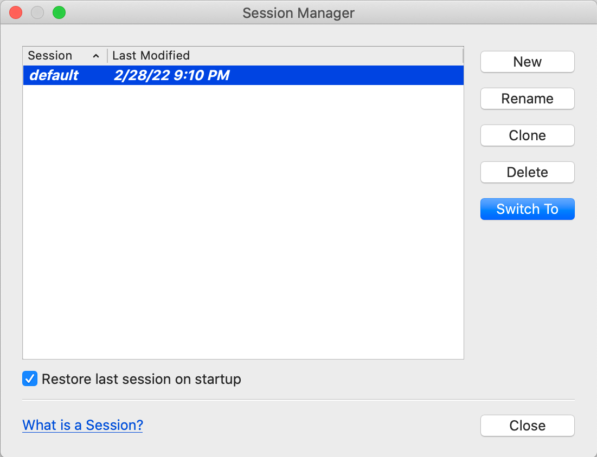

# L'interface de Qt Creator

> [Revenir à la page principale du tutoriel](README.md)

Lors du premier lancement de Qt Creator, vous arrivez sur la page d'accueil suivante :

## Gérer les sessions

Sans entrer en détail dans la configuration de Qt Creator, il y a une fonctionnalité très utile que je vous conseille d'activer.
Allez dans le menu `File` puis `Sesssion` puis `Manage...` pour ouvrir le gestionnaire de sessions. Une session est l'état de
Qt Creator à un moment donné (incluant la liste des projets et fichiers ouverts). Par défaut, il existe une sessions `default`.

Avoir plusieurs sessions peut être intéressant si vous travaillez sur plusieurs environnements en même temps. Par exemple, si
vous travaillez la journée sur plusieurs projets professionels et le soir sur plusieurs projets personnels. En créant une session
"travail" et une session "personnelle", vous pouvez passer de l'un à l'autre facilement et sans être obligé de conserver tous vos 
projets ouverts en même temps.

L'option que je vous conseille d'activer dans tous les cas est `Restore last session on startup`. Cela permet que Qt Creator
conserve son état lors que vous fermez Qt Creator puis que vous le réouvrez. Cela permet de reprendre le travail plus rapidement
quand vous revenez sur Qt Creator.
