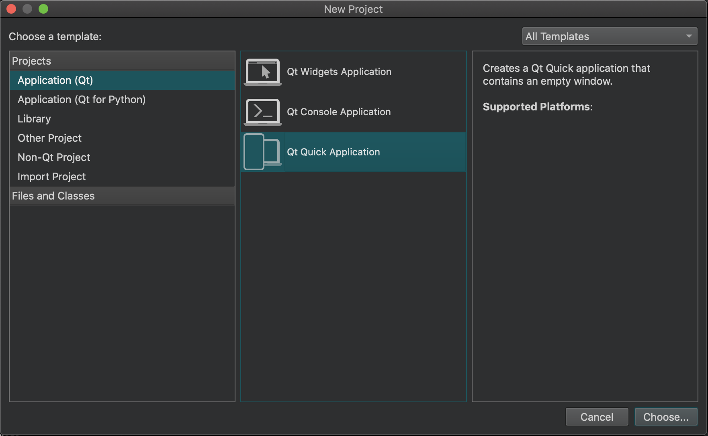
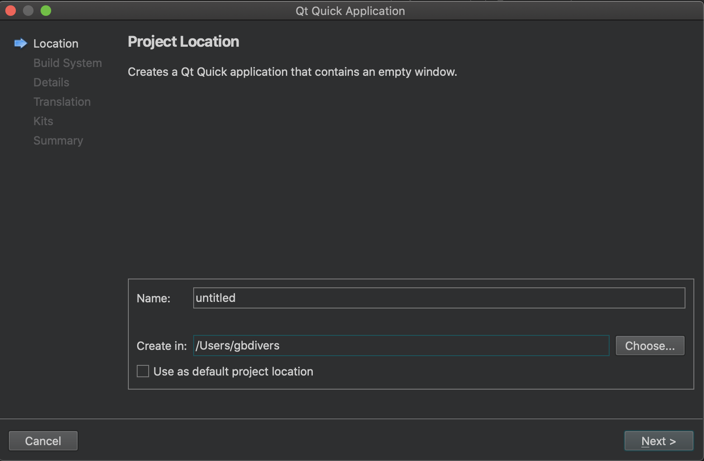
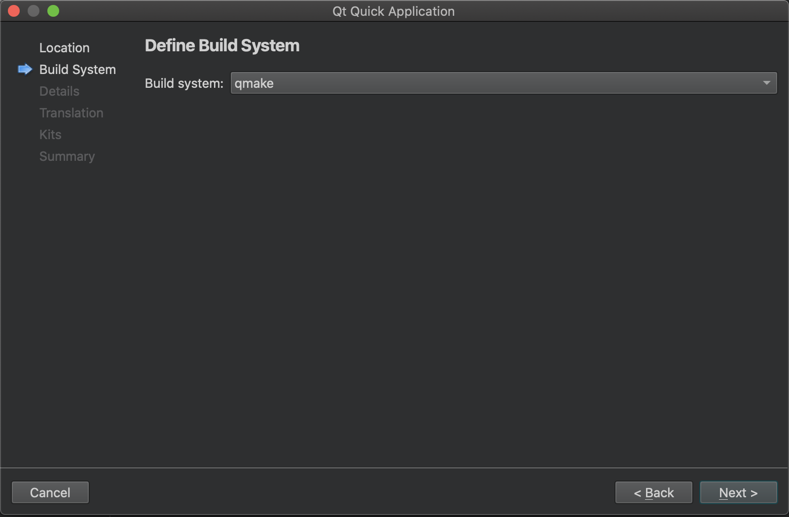
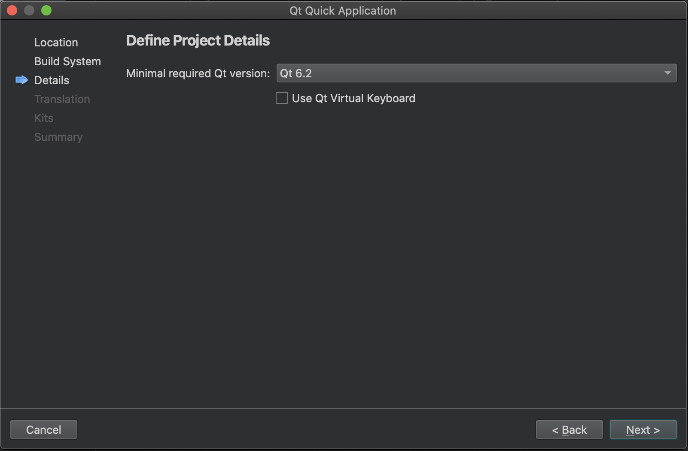
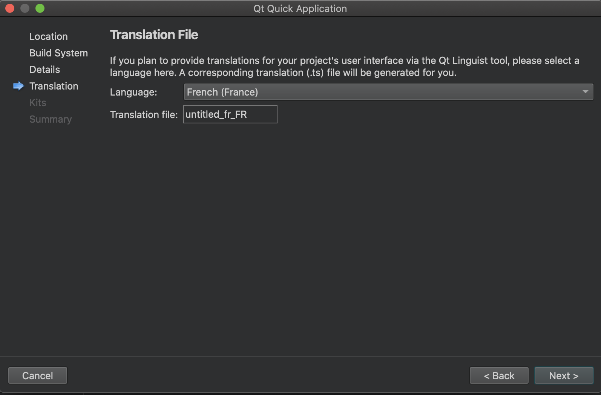
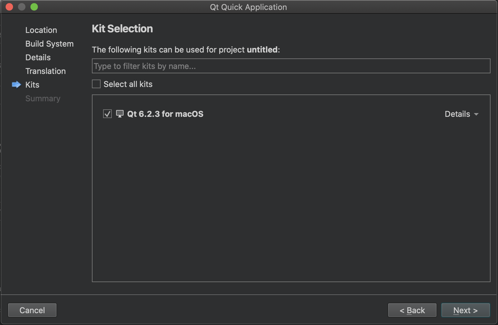
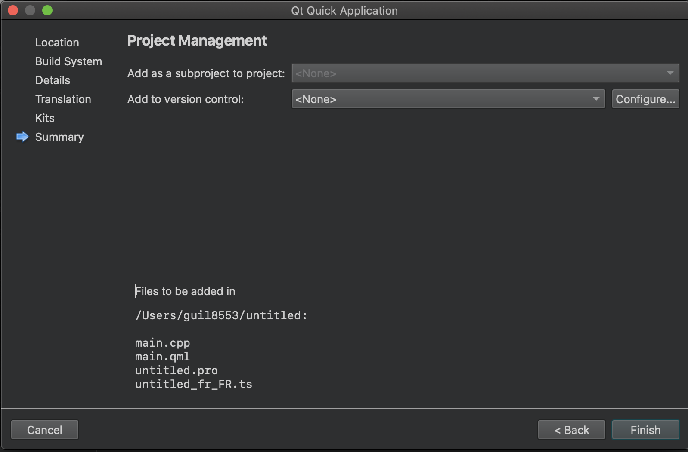
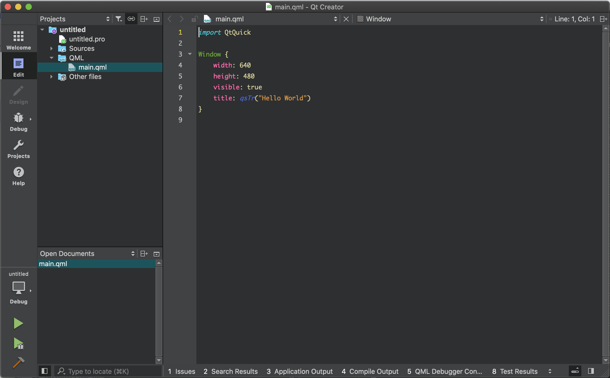
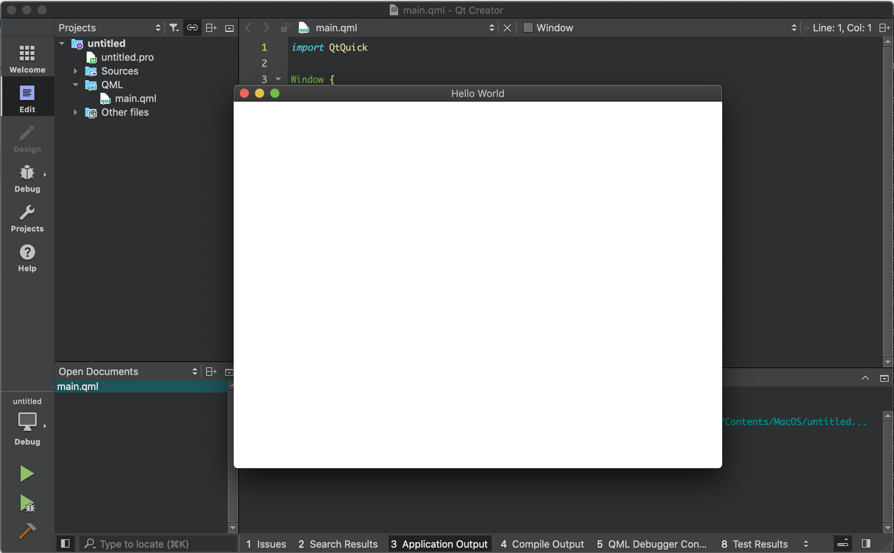

# Créer un projet avec Qt Creator

> [Revenir à la page précédente](README.md)

## Creer un projet Qt

Si l'installation de Qt s'est correctement passé, vous devriez pouvoir créer un projet par défaut dans Qt Creator et celui-ci devrait fonctionner
directement. C'est donc intéressant de créer un tel projet, même si vous ne souhaitez pas utiliser Qt Creator par la suite, pour tester
votre installation de Qt.

Pour créer un nouveau projet, allez dans le menu `File` puis `New file or project...`. Le dialogue qui s'ouvre permet de choisir le type de projet
que vous voulez créer. Dans la colonne de gauche, vous avez la liste des catégories de projets et dans celle de droite la liste des projets. Choissez
la catégorie `Application (Qt)` à gauche puis `Qt Quick Application` à droite. Cliquez ensuite sur `Choose...`.

La page suivante permet de choisir le nom du projet (prenez un nom simple, sans caractères spéciaux ni espace) et l'emplacement.

Note : si vous avez créé un dépôt Git local et souhaitez créer votre projet Qt dans celui-ci, Qt Creator va créer un sous-dossier dans
le dosser de votre dépôt. Pour éviter cela, le plus simple est de créer votre projet Qt en dehors du dépôt, puis de copier les fichiers
de votre projet dans le dépôt. Par la suite, vous pourrez travailler directement dans le dossier du dépôt.

La page suivante permet de choisir l'outil de build a utiliser pour compiler votre projet. Sélectionnez `qmake`.

Note : `cmake` est l'outil recommandé officiellement pour Qt 6, `qmake` est l'outil historique. Personnellement, je trouve que `cmake` est mal 
intégré dans Qt Creator et c'est pour cela que ce cours utilise `qmake`. De toute façon, l'outil de build n'est pas un choix critique dans
de nombreux types de projets et ne change rien pour votre apprentissage de Qt 6. Dans le futur, pour de vrais projets, n'hésitez pas à tester
`cmake`.

Selectionnez ensuite la version minimale de Qt pour compiler votre projet. Cela permet d'avoir des projets qui supportent d'anciennes versions de
Qt, mais cela nécessite d'adapter le code en conséquence. Le plus simple est de choisir la dernière version de Qt.

Qt contient en interne des outils d'internationalisation des applications, de façon à pouvoir proposer plusieurs langages pour votre interface
graphique. Vous verrez par la suite comment créer les traductions et rendre votre code compatiblee avec l'internationalisation. Pour le moment, 
ajoutez un fichier de langage, par exemple le français.

Note : par défault, je vous conseille de toujours écrire vos codes en anglais, même le texte qui s'affiche dans l'interface graphique. 

Choisissez ensuite le kit à utiliser. Un kit est un ensemble d'options de configuration (plateforme de destination, compilateur, version de Qt, etc).
Normalement, si vous avez suivi les instructions d'installation de ce cours, vous ne devriez avoir qu'un seul kit à sélectionner. Si vous avez plusieurs
kits, choisissez celui avec Qt 6.2.

La page suivante permet de créer le projet comme sous-projet d'un autre gros projet et de choisir l'outil de versionnage. Passez simplement
cette page en cliquant sur `Finish`.

Le nouveau projet est alors créé et Qt Creator affiche :
- en haut à gauche, l'architecture du projet ;
- en bas à gauche, la liste des fichiers ouverts ;
- à droite, le fichier ouvert.

Dans la capture d'écran, il n'y a qu'un seul fichier ouvert : `main.qml`.

Cliquez ensuite sur le triangle vert en bas à gauche ou taper sur `Ctrl+R` pour lancer la compilation puis exécuter l'application. 
Une fenêtre vide avec le titre `Hello world` s'affiche alors (si tout c'est bien passé).

Pour tester, dans le fichier `main.qml`, changez le texte `hello world` par un autre texte puis relancez l'exécution. Vous devriez voir que
le titre de la fenêtre a changé.

Explorez Qt Creator, pour découvrir les fonctionnalités qui pourraient vous plaire. Essayez par exemple :

- de diviser l'affichage des fichiers ouverts pour en afficher plusieurs à la fois ;
- de trouver les messsages de compilation et de sortie d'application ;
- de créer des marque-pages et afficher la liste ;
- etc.

## Versionner le projet avec Git

Dans le chapitre précédent, vous avez créer un dépôt Git local pour versionner votre projet et 

Mettre le projet Qt dans le dépôt Git et envoyer les modifications sur GitHub

