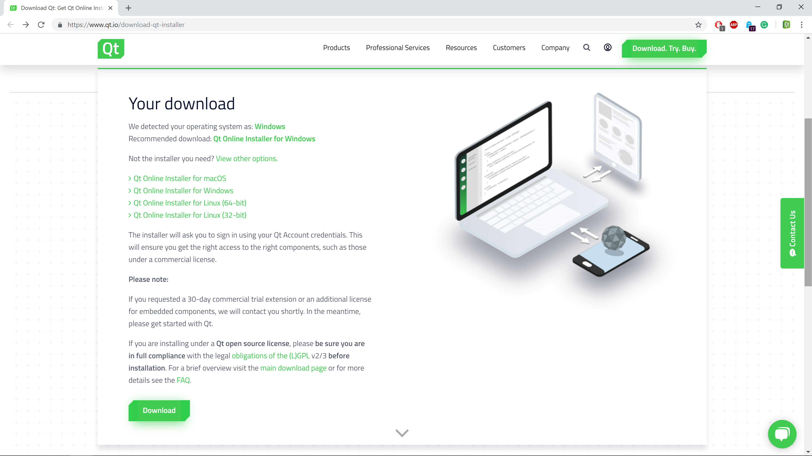

# Télécharger l'installateur de Qt 5

> Dernière mise à jour : 2 janvier 2019.
>
> Revenir a la page d'accueil : [Installation et premiers pas avec Qt 5.12](index.md)
>
> Chapitre précédent : [Installer un compilateur C++](compiler.md)
>
> Chapitre suivant : [Installer Qt 5.12](install.md)

_Attention : évitez de télécharger des fichiers, en particulier des applications, sur des sites non-officiels, 
pour minimiser le risque d'installer des logiciels malveillants._

## Le site officiel de Qt

### La page de téléchagement 

Le téléchargement de Qt se fait sur le [site officiel de Qt](http://www.qt.io/). 


Le site est conçu pour aider
les utilisateurs à choisir la version correcte de Qt (en orientant pas mal vers la version commerciale...), 
ce qui le rend un peu complexe au premier abord. Dans ce tutoriel, nous allons installer la version
open-source de Qt, donc nous n'allons pas détailler le site de Qt.



Pour ceux qui possèdent une licence commerciale de Qt : il est possible d'entrer votre numéro de licence, 
même si vous télécharger la version open-source. Et je trouve qu'il est plus facile de mettre à jour Qt si
vous installez la version open-source, donc je vous conseille de faire cela, même si vous avez une licence commerciale.

Pour télécharger la version open-source de Qt, le plus simple est d'aller directement 
sur la [page de telechargement](https://www.qt.io/download-qt-installer) et de cliquer sur le 
bouton `Download` en bas à gauche. Votre systeme d'exploitation est automatiquement reconnu et l'installateur
correspond est proposé par defaut.

Par exemple, sur la capture d'ecran precedente, vous pouvez lire les lignes suivantes :

```
We detected your operating system as: Windows
Recommended download: Qt Online Installer for Windows
```

Le nom de l'installateur dépend du système :

- pour Windows : `qt-unified-windows-x86-3.0.6-online.exe` ;
- pour Linux 32 bits : `qt-unified-linux-x86-3.0.6-online.run` ;
- pour Linux 64 bits : `qt-unified-linux-x64-3.0.6-online.run` ;
- pour Mac : `qt-unified-mac-x64-3.0.0-online.dmg`.

Le numero de version correspond a l'installateur. Qt Creator (l'editeur de code
de Qt) et Qt (le framework de developpement) ont des numeros de version differents, 
il ne faut pas les confondre.

Notez que le numero de version de l'installateur pourra etre different lorsque vous telechargerez
Qt.


Une fois que le téléchargement est terminé (c'est rapide, le fichier ne fait que quelques Mo), vous pouvez 
lancer l'installateur.

### Autres liens utiles

Vous trouverez sur le [site officiel de Qt](http://www.qt.io/) d'autres liens interessants :

- la [documentation de Qt](http://doc.qt.io/), qui est accessible également dans Qt Creator en appuyant sur 
la touche `F1` ;
- le [blog officiel de Qt](http://blog.qt.io/dev/) et les [blogs partenaires de Qt](http://planet.qt.io/) ;
- le [wiki officiel de Qt](http://wiki.qt.io/Main), qui contient de nombreuses informations complementaires a la documentation ;
- le [forum officiel de Qt](https://forum.qt.io/), en anglais.

## Installateurs online et offline

Il existe deux versions de l'installateur : `online` et `offline`. Les deux versions installe l'outil
`Qt Maintenance Tool`, qui permet d'installer, desinstaller et mettre a jour Qt. La version `online` ne
contient que cet outil, et c'est celui-ci qui va installer Qt. La version `offline` contient tout
ce qui est necessaire pour installer une version complete de Qt, sans avoir besoin d'etre connecte
a internet _pendant l'installation_. Naturellement, l'installateur `offline` est plus volumineuse que 
l'installateur `online`.

Lors de l'installation de Qt, l'outil `Qt Maintenance Tool` est installe dans le repertoire d'installation de Qt. 
Par défaut, cet outil se trouve :

- pour Windows : dans `C:\Qt\maintenancetool.exe` ;
- pour Linux et Mac : dans `~/Qt/MaintenanceTool`.

## Autres téléchargements possibles

Si vous souhaitez voir les autres téléchargements possibles, vous pouvez cliquer sur le lien `View All Downloads`. 
Cela permet d'afficher, dans l'ordre, les liens suivants :

- Les installateurs online pour tous les systèmes (linux 64b et 32b, Mac et Windows) ;
- Les installateurs offline pour Linux, Mac et Windows ;
- Les sources de Qt (Qt étant un projet libre, ses sources sont librement accessibles) ;
- L'éditeur Qt Creator seul ;

Les autres outils :

- les plugins pour Visual Studio ;
- l'outil JOM (outil de compilation similaire à nmake, dédié à Qt) ;
- le Qt Build Suite (QBS) (un outil de build, probable futur remplaçant de qmake) ;
- Qt Installer Framework (pour créer vos propres installateurs pour vos programmes) ;
- les dépôts Git de Qt ;
- les archives des anciennes versions de Qt (ce dernier lien permet en particulier de télécharger Qt 4 si nécessaire).
