# Installer Qt 5.9.1

> Dernière mise à jour : 27 aout 2017.

> Revenir a la page d'accueil : [Installation et premiers pas avec Qt 5.9.1](index.md)

Pour installer ou mettre des versions de Qt, lancez l'installateur que vous avez telecharge a l'etape precedente, si 
vous installez Qt pour la premiere fois. Ou lancez l'outil `Qt Maintenance Tool` qui se trouve dans le repertoire 
d'installation de Qt si vous avez deja installe Qt.

La premiere page donne des informations generales sur les licences, avec des liens pour plus d'informations.

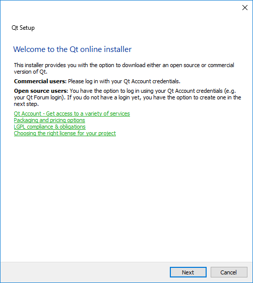

La page suivante permet de se connecter a son compte Qt ou de creer une compte Qt. Si vous possedez
un compte avec une licence commerciale de Qt, cette licence sera automatiquement telechargee
depuis votre compte en ligne pour l'installation.

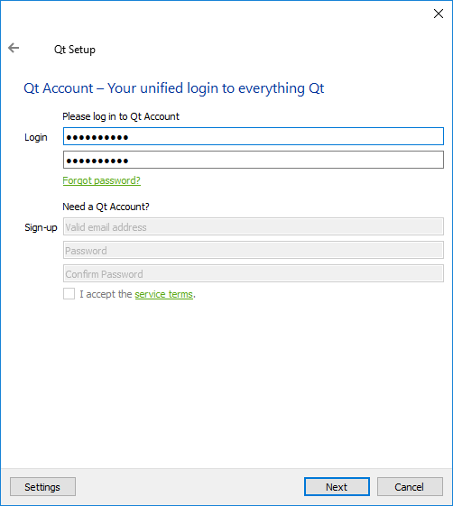

Cette page sert simplement à vous souhaitez la bienvenue. Cliquez sur `Suivant`. L'installateur lance 
alors une recherche en ligne pour mettre a jour les informations sur les versions disponibles de Qt.

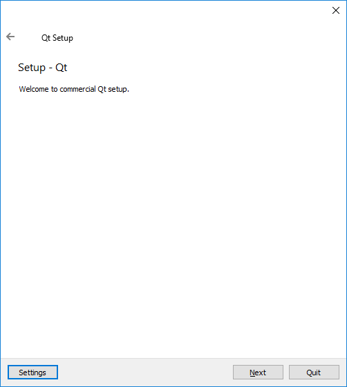

La page suivante permet de choisir le repertoire d'installation de Qt. Par defaut, ce repertoire
est `C:\Qt` sur Windows et `~/Qt` sur MacOS X et Linux.

Vous pouvez changer le répertoire d'installation si vous le souhaitez. Dans la suite de ce tutoriel, nous 
allons utiliser le chemin par défaut. Si vous changez de répertoire, pensez à adapter les chemins donnés 
dans la suite de ce tutoriel.

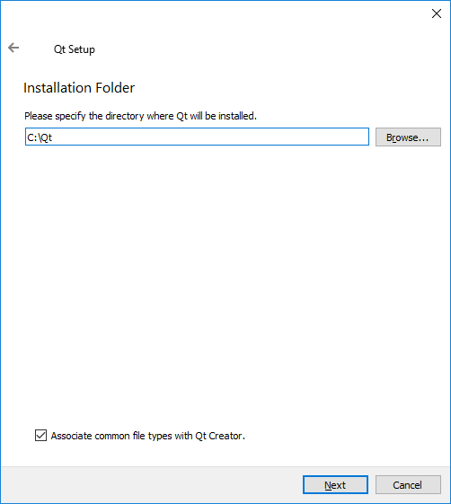

La page suivante permet de sélectionner la liste des outils à installer. Pour programmer en C++ avec Qt,
il faut installer au moins trois outils :

  * un **éditeur**. Qt (le framework) est fourni avec un éditeur appelé Qt Creator. (Ne confondez pas
  l’éditeur et le framework). Cet éditeur est installé automatiquement et il n'est pas possible de le 
  désactiver ;
  * au moins une version de **Qt** ;
  * un **compilateur** compatible avec la version de Qt installée. Si vous installez plusieurs versions
  de Qt, vous devez installer chaque compilateur correspondant a ces versions.

La liste des composants se presente sous forme d'une arbre. Dans la categorie `Preview` (si elle est
presente), vous trouverez les versions de Qt en cours de developpement. Ces versions sont destinees aux
utilisateurs experimentes, qui peuvent ainsi tester les futures versions de Qt avant qu'elles ne sortent
officiellelement et signaler les eventuels bugs.

La categorie `Qt` contient les outils qui nous interesse dans ce tutoriel. Cette categorie
contient toutes les versions de Qt que vous pouvez installer, dans l'ordre des versions (les 
plus recentes en haut de la liste). La version actuelle est Qt 5.9.1. Selectionnez les versions
de Qt que vous souhaitez installer. Je vous conseille :

- pour Windows : `MingGW  5.3.0 32 bit` ou `msvc2017 64-bit` (attention de bien installer le compilateur 
correspondant) ;
- pour MacOS X : `macOS` ;
- pour Linux : `gcc 5.3` ;
- pour Android : `Android ARMv7` ;
- pour iOS : `iOS` ;
- pour Universal Windows Platform : `UWP armv7 (MSVC2017)` et `UWP x64 (MSVC2017)`.

Le paquet `Sources` contient les sources de Qt. Vous pouvez installer ce paquet si vous etes un utilisateur
averti et que vous souhaitez compiler Qt vous meme. (Ou contribuer a Qt).

Dans la liste des paquets, vous pouvez egalement trouver des modules supplementaires, comme 
`Qt Charts` ou `Qt Speech (TP)`. Ces modules ne sont pas installes par defaut avec Qt, parce qu'ils
ont une licence differente (comme `Qt Charts`) ou parce que ce sont des versions en cours de
developpement (`TP` veut dire `Technology Preview`).

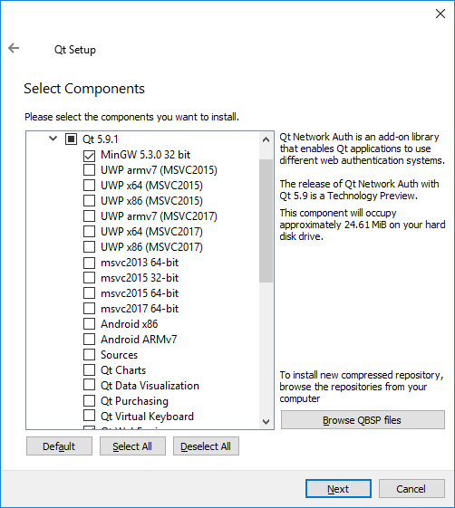

Tout en bas de la liste, vous trouverez la categorie `Tools`, qui contient plusieurs outils :

- l'editeur Qt Creator 4.3.1 (vous ne pouvez pas deselectionner cette installation) ;
- le support de l'outil de debug CDB, a installer si vous utiliser Visual Studio ;
- differentes versions du compilateur MinGW (uniquement sur Windows). Installez `MinGW 5.3.0`
si vous avez installer la version de Qt correspondante ;
- l'outil pour creer des installateurs, `Qt Installer Framework 2.0`.

Pour des raisons de licences logicielles, l'installeur Qt ne fournit que le compilateur MinGW, sur Windows. 
Pour installer les autres compilateurs (Clang et GCC sur MacOS X, Linux, ou Android, Visual Sutio sur Windows),
vous ne pouvez pas le faire directement dans l'installateur, il faut suivre une procedure specifique pour
chaque compilateur. Voir le chapitre [Installer un compilateur C++](compiler.md).

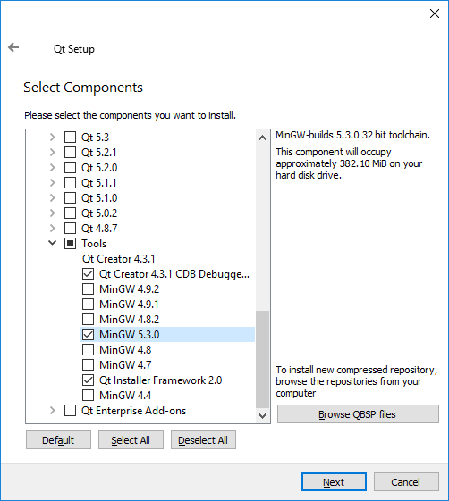

Cette page permet de lire et d'accepter les licences correspondant aux outils que vous installez.

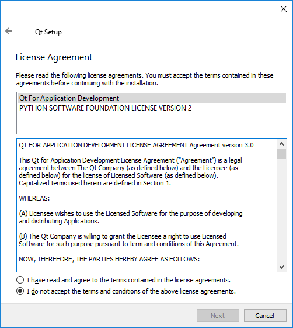

Cette page permet de choisir le répertoire dans le menu `Démarrer` sur Windows.

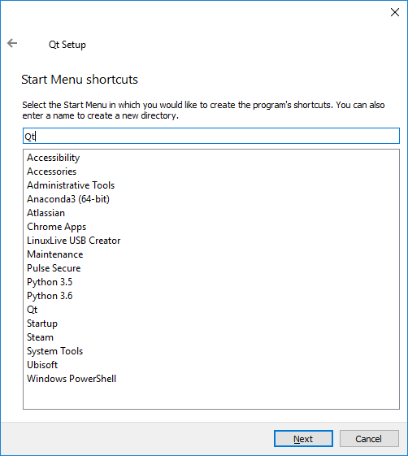

Une fois que tout cela est fait, l'installation est prête à démarrer. Cliquez sur `Installation`.

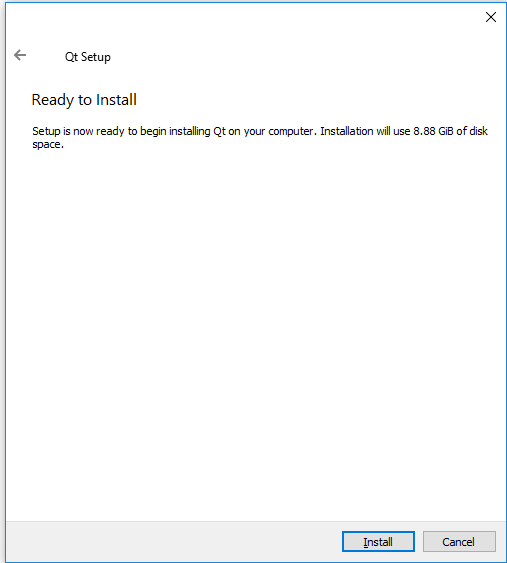

Le téléchargement puis l'installation se lancent. Selon votre connexion et le nombre de paquets que vous 
installez, cela peut prendre plusieurs minutes à plusieurs heures (si vous souhaitez installer beaucoup de
paquets, il est probablement préférable de répéter l'installation plusieurs fois). L'installation sature 
le processeur, ne vous étonnez pas trop si Windows devient un peu lent pendant ce temps-là. Allez vous balader 
dehors, il fait beau (la pluie, c'est beau...).

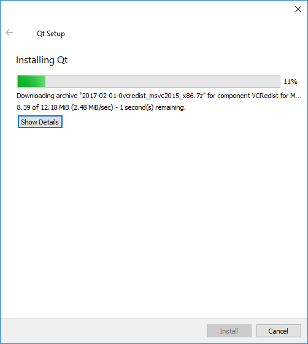

Une fois que l'installation est terminée, la page suivante propose de lancer Qt Creator.

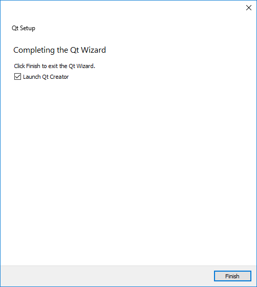

Cliquez sur `Terminer`. Qt Creator s'ouvre et affiche la page d'accueil.
