# Installer Qt 5.14.0

> Dernière mise à jour : 30 janvier 2020.
>
> Revenir a la page d'accueil : [Installation et premiers pas avec Qt 5.14.0](index.md)
>
> Chapitre precedent : [Télécharger l'installateur de Qt](download.md)
>
> Chapitre suivant : [Tester l'installation de Qt 5.14.0](test.md)

Pour installer ou mettre à jour des versions de Qt, lancez l'installateur que vous avez téléchargé à l'étape précédente, si 
vous installez Qt pour la premiere fois. Ou lancez l'outil `Qt Maintenance Tool` qui se trouve dans le répertoire 
d'installation de Qt si vous avez déjà installé Qt.

La première page donne des informations générales sur les licences, avec des liens pour plus d'informations.

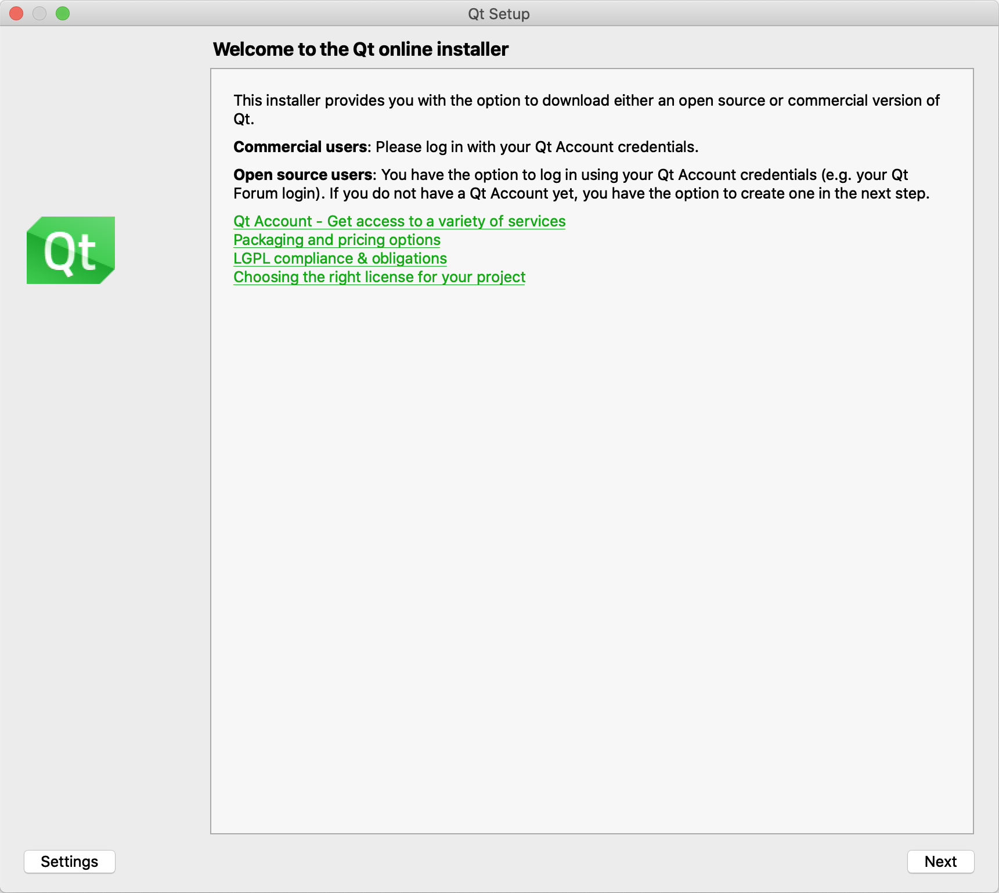

La page suivante permet de se connecter à son compte Qt ou de créer un compte Qt. Si vous possédez
un compte avec une licence commerciale de Qt, cette licence sera automatiquement téléchargée
depuis votre compte en ligne lors de l'installation.

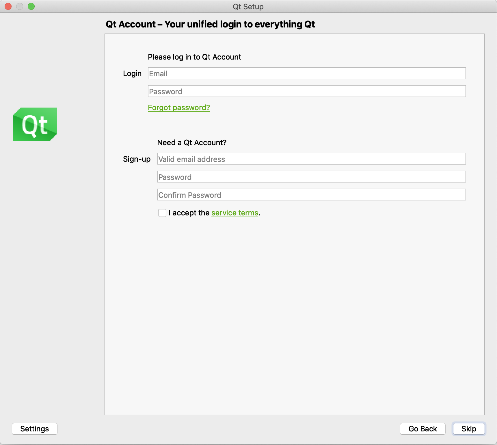

Cette page sert simplement à vous souhaitez la bienvenue. Cliquez sur `Suivant`. L'installateur lance 
alors une recherche en ligne pour mettre à jour les informations sur les versions disponibles de Qt.

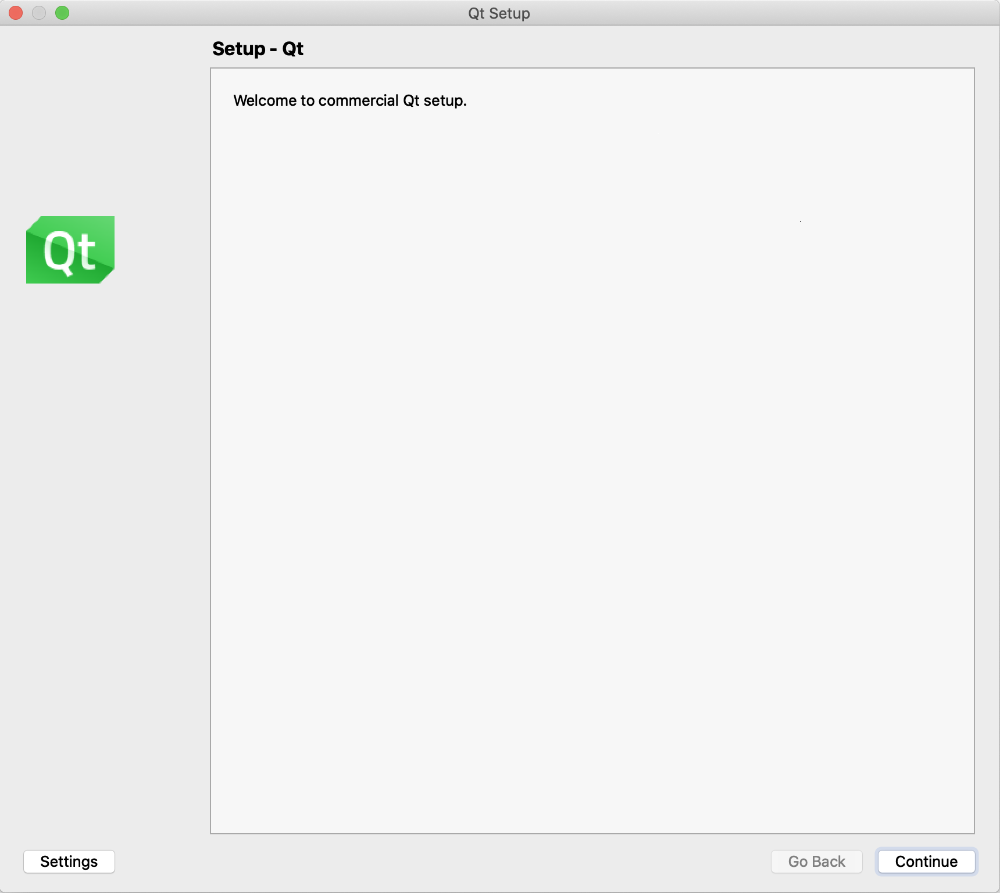

**Sur MacOSX uniquement**

Si vous n'avez pas installé XCode (l'outil de développement sous MacOSX) précédement, l'installateur de Qt vous
propose de l'installer maintenant. Cliquez sur le bouton `Install`

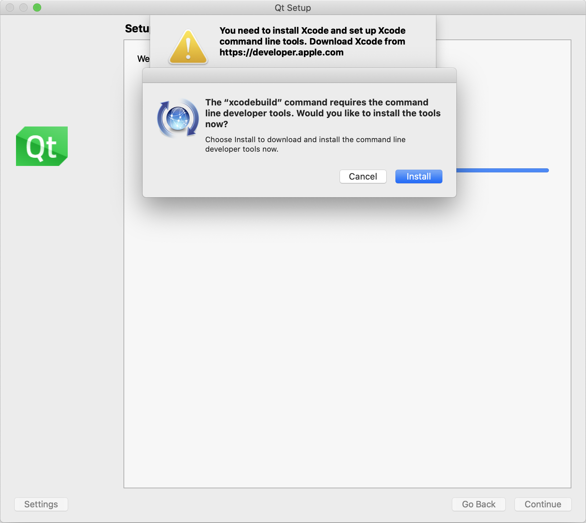

Cliquez sur le bouton `Agree` pour accepter la licence des outils en ligne de commande.

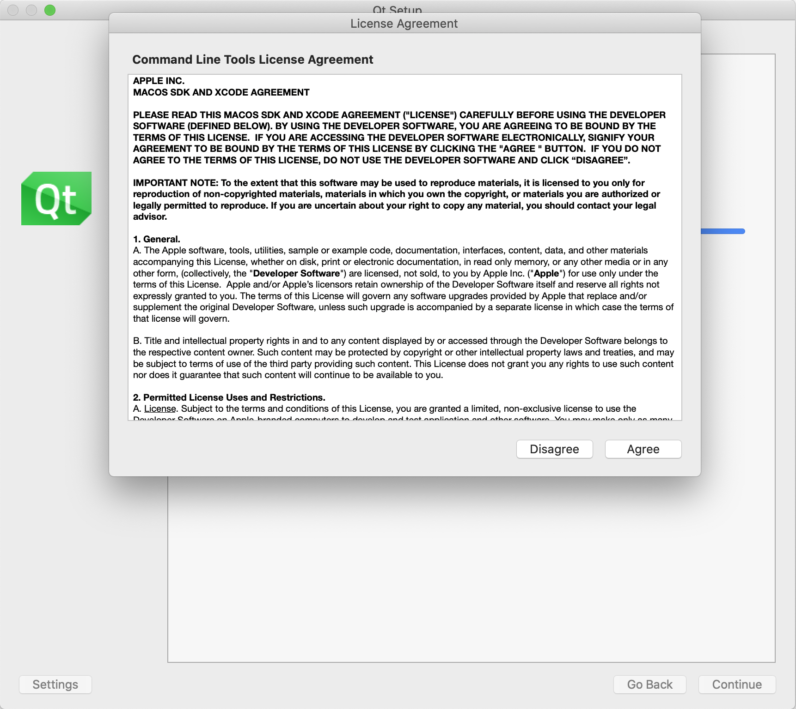

**Sur toutes les plateformes**

La page suivante vous propose de contribuer à l'expérience utilisateur de Qt Creator en envoyant des
statistiques anonymisées de votre utilisation de Qt Creator. Vous pouvez acceptez si vous le souhaitez, mais
ce n'est pas obligatoire.

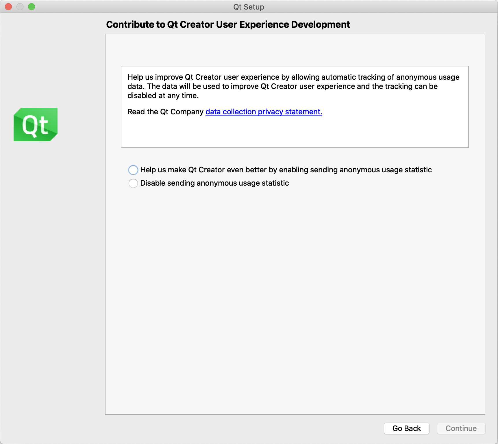

La page suivante permet de choisir le répertoire d'installation de Qt. Par défaut, ce repertoire
est `C:\Qt` sur Windows et `Users/your_name/Qt` sur MacOSX et Linux.

Vous pouvez changer le répertoire d'installation si vous le souhaitez. Dans la suite de ce tutoriel, nous 
allons utiliser le chemin par défaut. Si vous changez de répertoire, pensez à adapter les chemins donnés 
dans la suite de ce tutoriel.

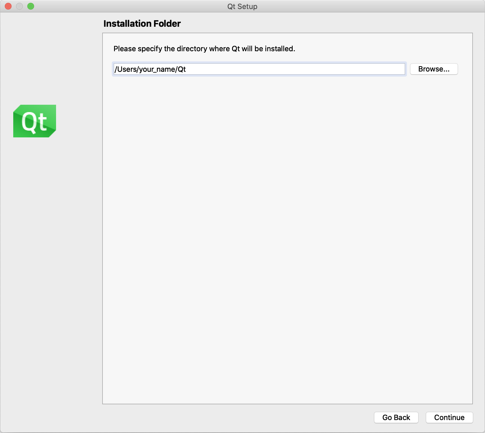

La page suivante permet de sélectionner la liste des outils à installer. Pour programmer en C++ avec Qt,
il faut installer au moins trois outils :

  * au moins une version de la bibliothèque **Qt**. Par défaut, aucune version n'est sélectionnée. Si vous
  n'en sélectionnez pas, Qt ne pourra pas fonctionner ;
  * un **éditeur**. Qt (le framework) est fourni avec un éditeur appelé Qt Creator. Ne confondez pas
  l’éditeur et le framework. Cet éditeur est installé automatiquement et il n'est pas possible de le 
  désactiver ;
  * un **compilateur** compatible avec la version de Qt installée. Si vous installez plusieurs versions
  de Qt, vous devez installer chaque compilateur correspondant à ces versions.

Les composants sont regroupés par catérogies à gauche : 

- `Archive` : anciennes versions de Qt, à utiliser uniquement pour la maintenance ;
- `LTS` (Long Term Support) : versions avec un support à long terme ;
- `Latest releases` : dernières versions de Qt ;
- `Preview` : les futures versions de Qt. Vous y trouverez les versions de Qt en cours de développement.
Ces versions sont déstiées aux utilisateurs expérimentés, qui peuvent ainsi tester les futures versions de 
Qt avant qu'elles ne sortent officiellelement et signaler les eventuels bugs.

Il est recommandé d'installer la dernière version de Qt uniquement. Pour cela, décohez toutes cases à gauche sauf
`Latest releases` puis cliquez sur `Refresh`. La liste à droite est mise à jour.

La catégorie `Qt` contient les outils qui nous intéresse dans ce tutoriel. Cette catégorie
contient toutes les versions de Qt que vous pouvez installer, dans l'ordre inverse des versions (les 
plus recentes en haut de la liste). La version actuelle est Qt 5.14.1. Sélectionnez les versions
de Qt que vous souhaitez installer. Je vous conseille dans `Qt 5.14.1` :

- pour Windows : `MingGW 7.3.0 64-bit` ou `msvc2017 64-bit` (attention de bien installer le compilateur 
correspondant) ;
- pour MacOS X : `macOS` ;
- pour Linux : `gcc 7.3` ;
- pour Android : `Android` ;
- pour iOS : `iOS`.

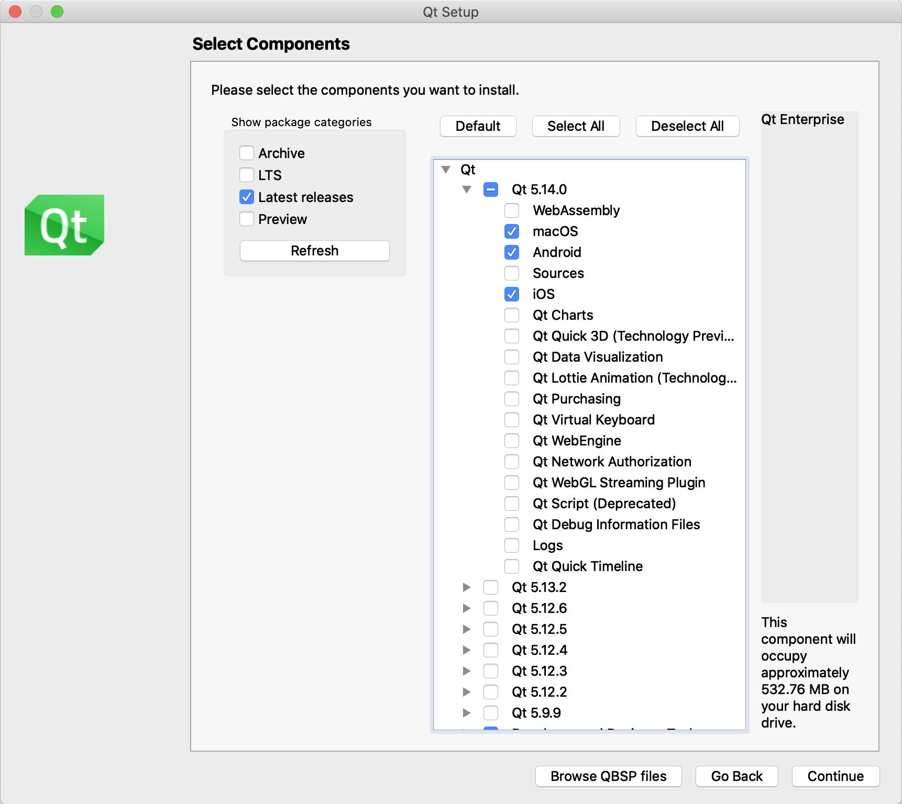

**Sur Windows uniquement**

Sur Windows, il est possible d'installer le compilateur MingW directement à partir de l'installateur de Qt.
Pour cela, commencez par installer la version de Qt correspondante à MingW 7.3.0 64 bits (`MingGW 7.3.0 64-bit` 
dans `Qt` puis `Qt 5.14.1`).

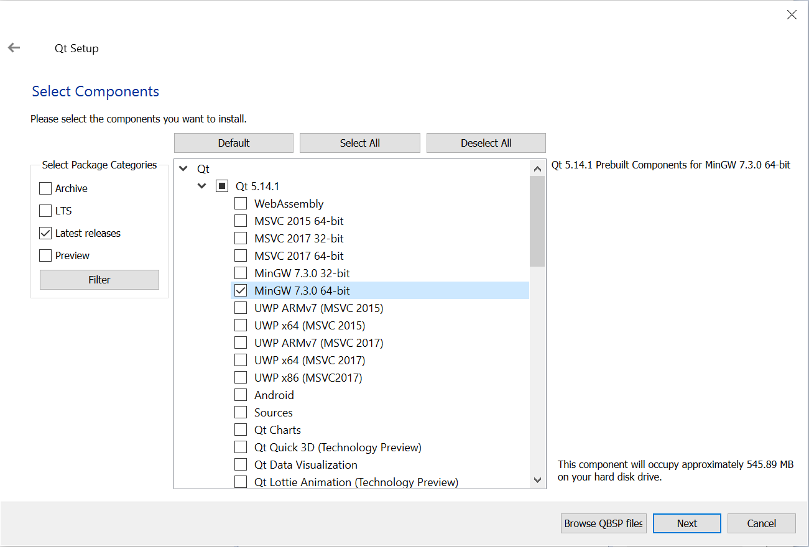

Puis allez dans `Developer and Designer Tools` et sélectionnez le compilateur `MingGW 7.3.0 64-bit`.

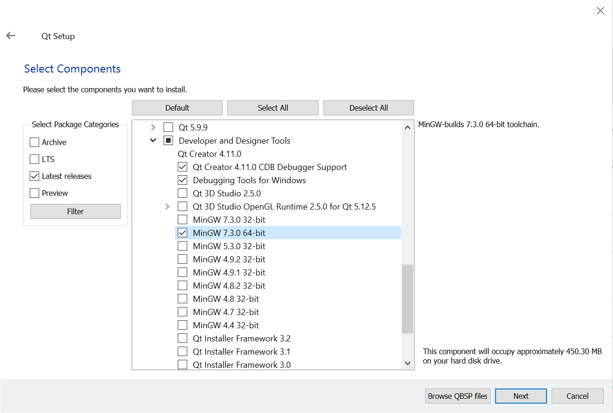

**Sur toutes les plateformes**

Pour des raisons de licences logicielles, l'installeur de Qt ne peut fournir que le compilateur MinGW pour Windows. 
Pour installer les autres compilateurs (Clang et GCC sur MacOS X, Linux, ou Android, Visual Studio sur Windows),
vous ne pouvez pas le faire directement dans l'installateur, il faut suivre une procedure spécifique pour
chaque compilateur. Voir le chapitre [Installer un compilateur C++](compiler.md).

Cette page permet de lire et d'accepter les licences correspondant aux outils que vous installez.

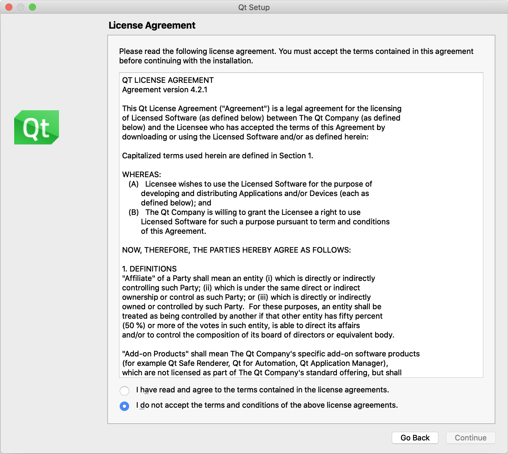

Cette page permet de choisir le répertoire dans le menu `Démarrer` sur Windows.

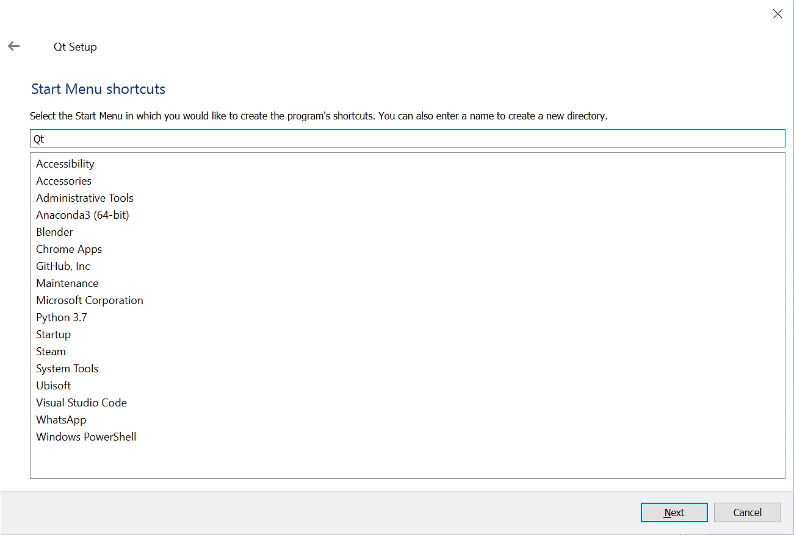

Une fois que tout cela est fait, l'installation est prête à démarrer. Cliquez sur `Install`.

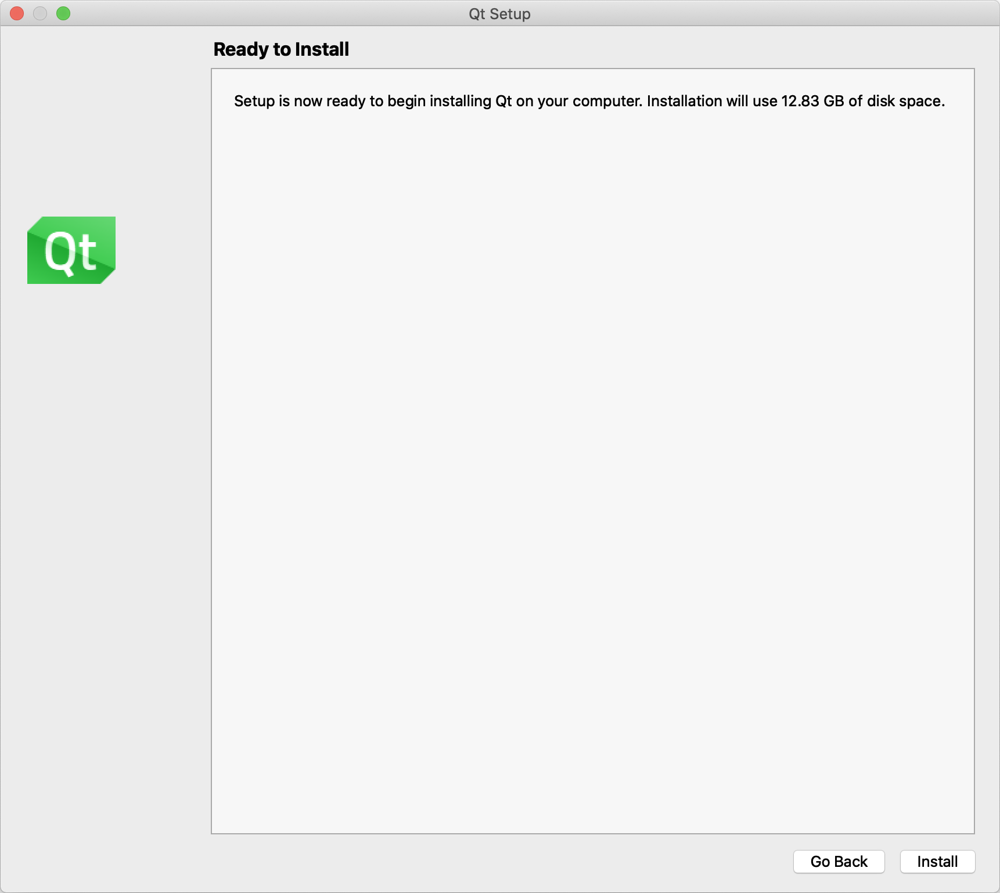

Le téléchargement puis l'installation se lancent. Selon votre connexion et le nombre de paquets que vous 
installez, cela peut prendre plusieurs minutes à plusieurs heures (si vous souhaitez installer beaucoup de
paquets, il est probablement préférable de répéter l'installation plusieurs fois). L'installation sature 
le processeur, ne vous étonnez pas trop si Windows devient un peu lent pendant ce temps-là. Allez vous balader 
dehors, il fait beau (la pluie, c'est beau...).

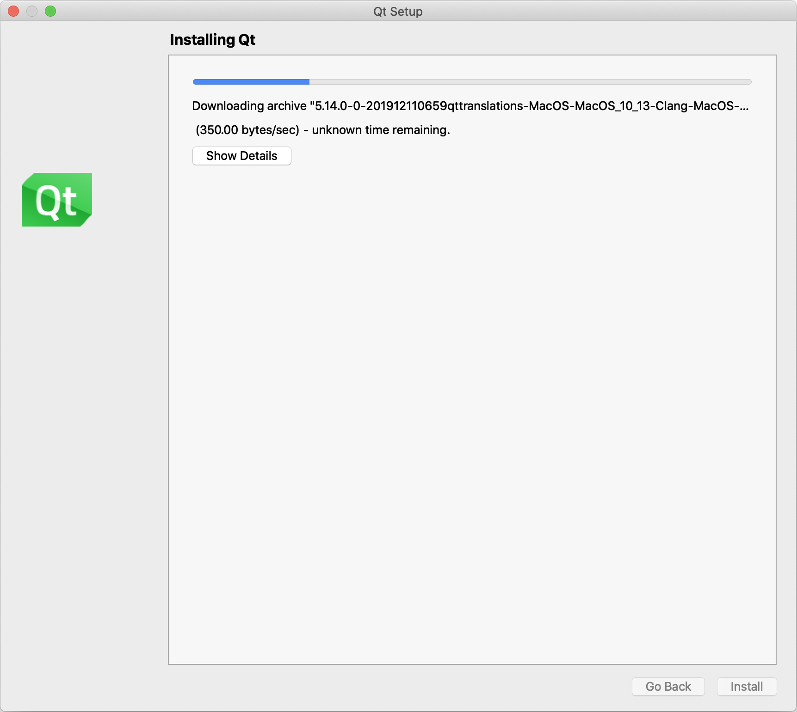

Une fois que l'installation est terminée, la page suivante propose de lancer Qt Creator.

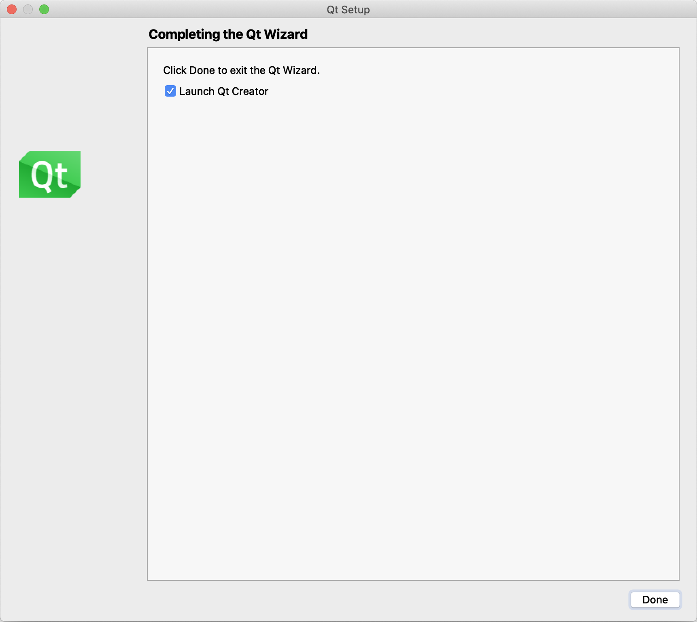

Cliquez sur `Terminer`. Qt Creator s'ouvre et affiche la page d'accueil.
